# DockerLens — Architecture

> **Version:** 1.0.0
> **Last Updated:** March 2026
> **TRD Reference:** `docs/requirements/TRD.md`
> **PRD Reference:** `docs/requirements/PRD.md`

---

## Table of Contents

1. [Overview](#1-overview)
2. [High-Level System Architecture](#2-high-level-system-architecture)
3. [Application Layers](#3-application-layers)
4. [IPC Communication Model](#4-ipc-communication-model)
5. [Rust Backend — Module Map](#5-rust-backend--module-map)
6. [Frontend — Component Tree](#6-frontend--component-tree)
7. [Docker API Integration](#7-docker-api-integration)
8. [Authentication — Supabase Flow](#8-authentication--supabase-flow)
9. [Real-Time Streaming Pipeline](#9-real-time-streaming-pipeline)
10. [Daemon Control Flow](#10-daemon-control-flow)
11. [Socket Auto-Detection](#11-socket-auto-detection)
12. [Cross-Distro Packaging Pipeline](#12-cross-distro-packaging-pipeline)
13. [User Flows](#13-user-flows)
14. [Screen Map](#14-screen-map)
15. [Visual Exports](#15-visual-exports)

---

## 1. Overview

DockerLens is a **native Linux desktop application** built with Tauri 2.0. It wraps a React + TypeScript frontend inside a native OS window, backed by a Rust core that communicates with Docker Engine via the Unix socket.

There are three distinct layers:
```
┌──────────────────────────────────────────────────┐
│  React + TypeScript  (WebView — what users see)  │
├──────────────────────────────────────────────────┤
│  Tauri IPC Bridge  (invoke / emit)               │
├──────────────────────────────────────────────────┤
│  Rust Core  (Docker client, daemon, tray, auth)  │
└──────────────────────────────────────────────────┘
                        ↕
              /var/run/docker.sock
                        ↕
              Docker Engine (dockerd)
```

The Rust backend **never** communicates with the internet directly. All network communication (Supabase auth, image pulls) is initiated by the React frontend via `supabase-js` and Docker API calls proxied through Rust respectively.

---

## 2. High-Level System Architecture
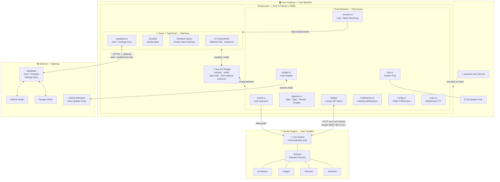

---

## 3. Application Layers
```mermaid
graph LR
    subgraph L1["Layer 1 — UI (WebView)"]
        direction TB
        COMPONENTS["React Components\nContainers · Images · Volumes\nNetworks · Settings · Onboarding"]
        STYLING["Tailwind CSS\nshadcn/ui components"]
        STATE2["Zustand Stores\napp · containers · auth"]
        QUERY2["TanStack Query\nDocker data cache"]
    end

    subgraph L2["Layer 2 — IPC Bridge"]
        direction TB
        INVOKE["invoke()\nReact → Rust calls"]
        EMIT["emit() / listen()\nRust → React events"]
    end

    subgraph L3["Layer 3 — Rust Core"]
        direction TB
        DOCKER_MOD["docker/\ncontainers · images\nvolumes · networks\nexec · streams"]
        SYSTEM_MOD["system/\nsocket · daemon · tray\nnotifications · config"]
    end

    subgraph L4["Layer 4 — OS / External"]
        direction TB
        UNIX["Unix Socket\ndockerd"]
        SYSTEMD["systemd\ndaemon control"]
        POLKIT["Polkit\nprivilege escalation"]
        SUPA2["Supabase\noptional"]
    end

    L1 <-->|"type-safe IPC"| L2
    L2 <-->|"#[tauri::command]"| L3
    L3 <-->|"system calls"| L4
```

---

## 4. IPC Communication Model

All communication between React and Rust flows through Tauri's IPC bridge. There is no HTTP server, no WebSocket exposed externally, and no shared memory between layers.
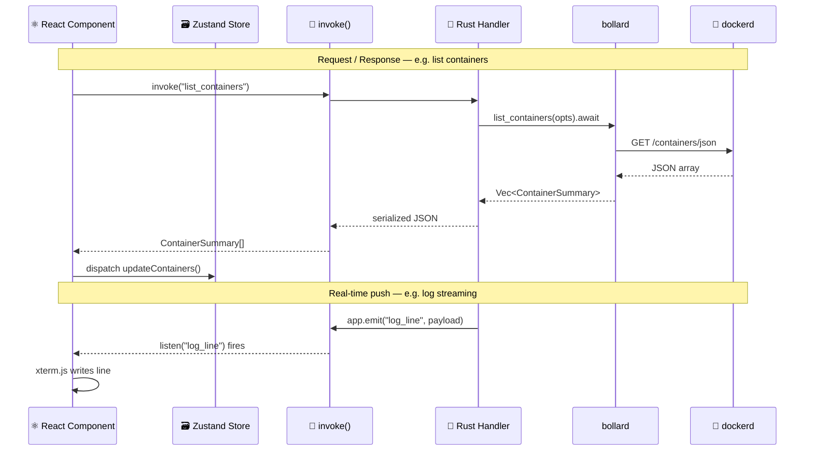

---

## 5. Rust Backend — Module Map
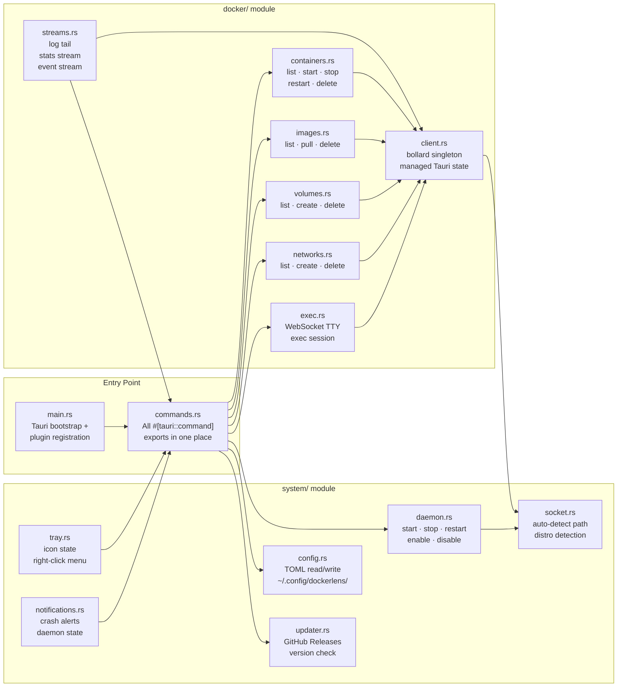

---

## 6. Frontend — Component Tree
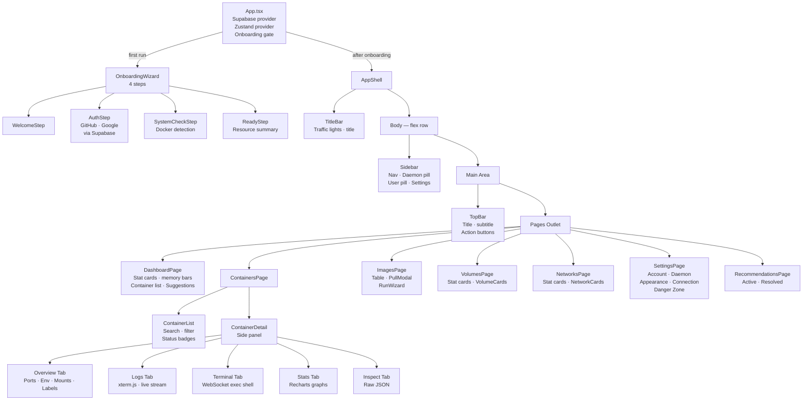

---

## 7. Docker API Integration
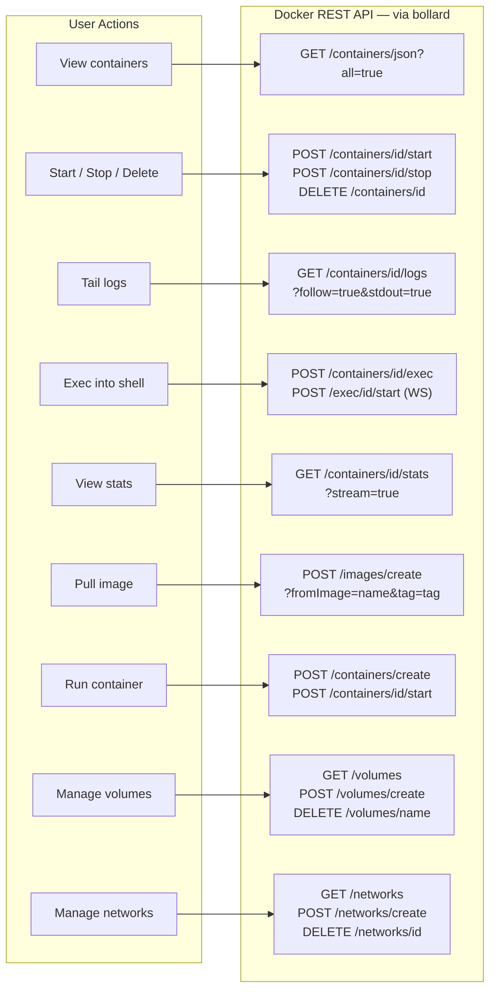

---

## 8. Authentication — Supabase Flow
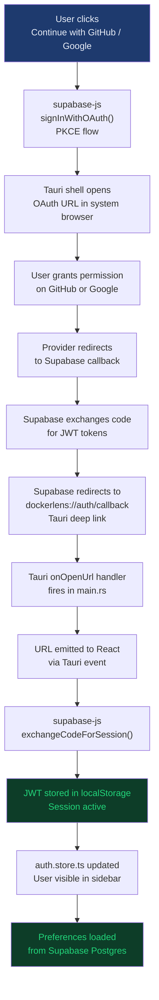

---

## 9. Real-Time Streaming Pipeline
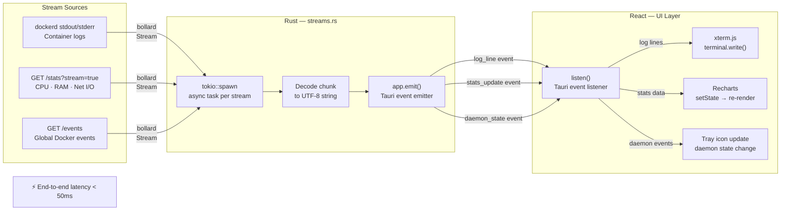

---

## 10. Daemon Control Flow
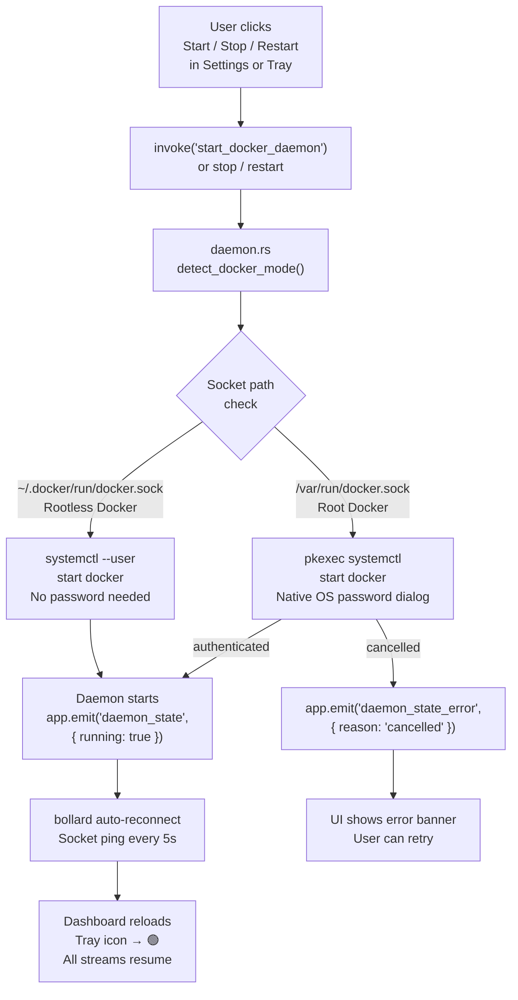

---

## 11. Socket Auto-Detection
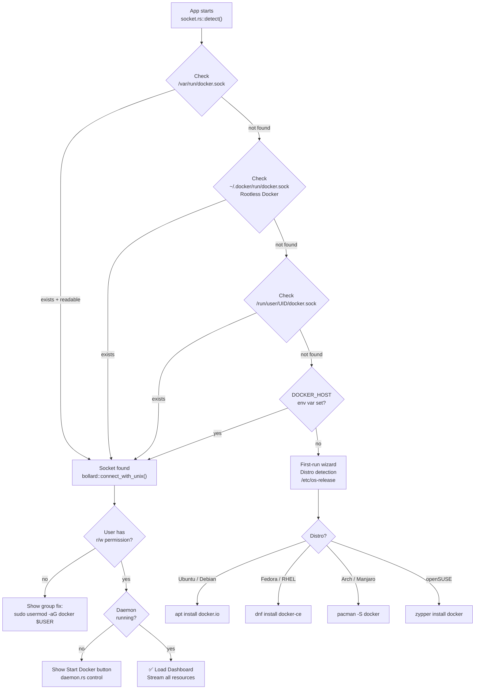

---

## 12. Cross-Distro Packaging Pipeline
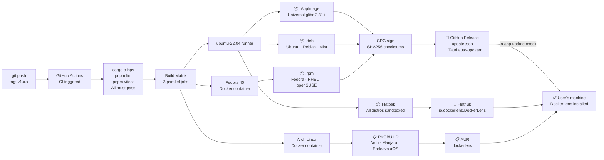

---

## 13. User Flows

### Flow 1 — First Launch & Onboarding
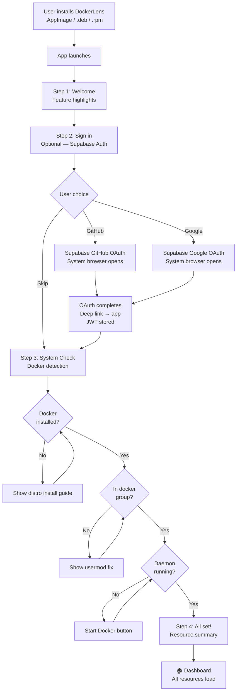

---

### Flow 2 — Container Lifecycle
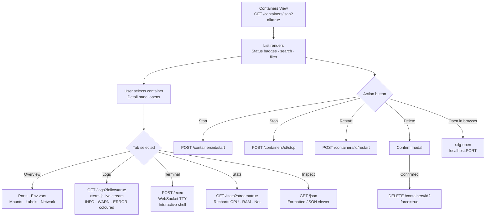

---

### Flow 3 — Image Pull & Run
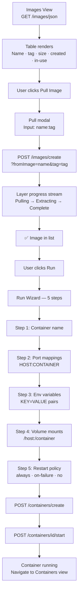

---

### Flow 4 — Daemon Control
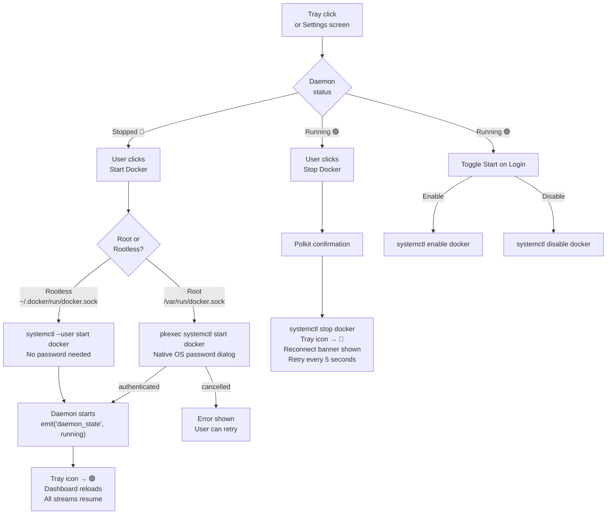

---

### Flow 5 — Suggestions Engine
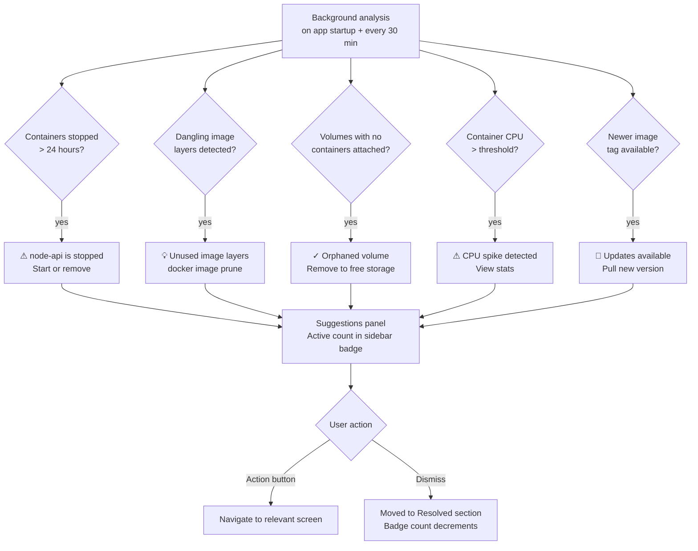

---

### Flow 6 — System Tray Background Mode
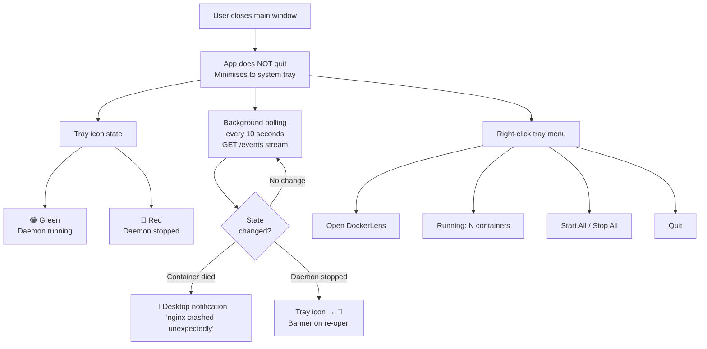

---

## 14. Screen Map
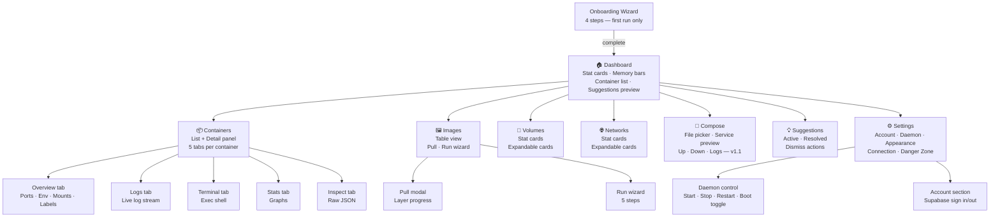

---

## 15. Visual Exports

The following PNG files in this folder are exported from FigJam and provide a visual complement to the Mermaid diagrams above. They are intended for contributors who prefer a visual overview before reading code.

| File | Contents | Source |
|---|---|---|
| `system-overview.png` | High-level system architecture — all layers, connections and external services | FigJam — DockerLens Full User Flow board |
| `user-flows.png` | All 6 user flows — onboarding, containers, images, daemon, suggestions, tray | FigJam — DockerLens Full User Flow board |
| `screen-map.png` | Complete screen navigation map — every page and how they connect | FigJam — DockerLens Screen Map board |

> **Note for contributors:** The Mermaid diagrams in this file are the authoritative source of truth. The PNG exports are supplementary and may lag behind by one version during active development. If there is a discrepancy, the Mermaid diagrams are correct.

---

## How This File Relates to the Rest of `docs/`
```
docs/
├── requirements/
│   ├── PRD.md        ← What to build and why
│   └── TRD.md        ← How to build it — full technical spec
└── architecture/
    ├── ARCHITECTURE.md   ← This file — visual overview of the system
    ├── system-overview.png
    ├── user-flows.png
    └── screen-map.png
```

The TRD contains the authoritative written specification. This file focuses on **visual communication** — every major system concept is represented as a Mermaid diagram so a new contributor can understand the full architecture in one read.