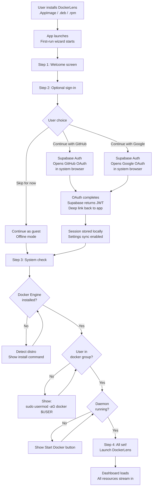
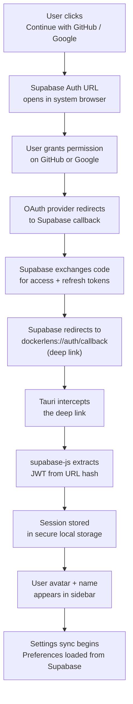
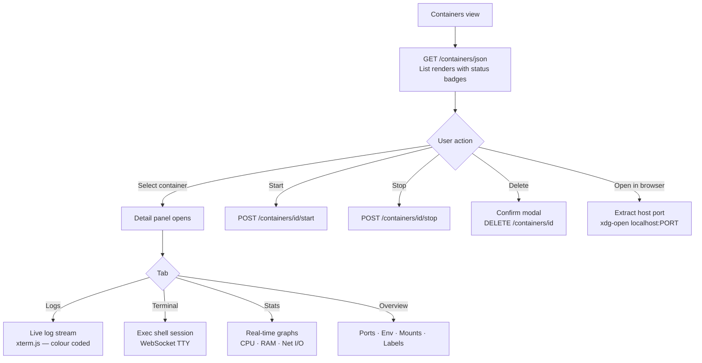
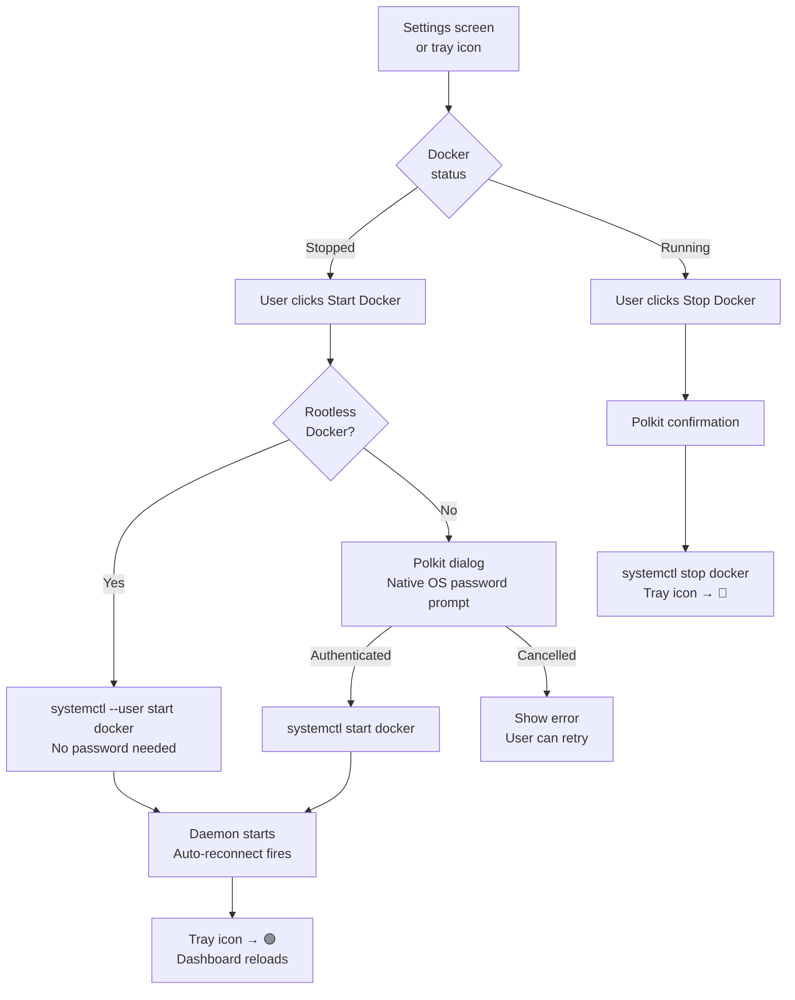
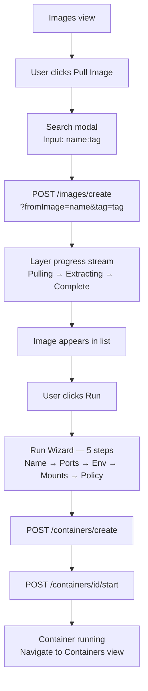
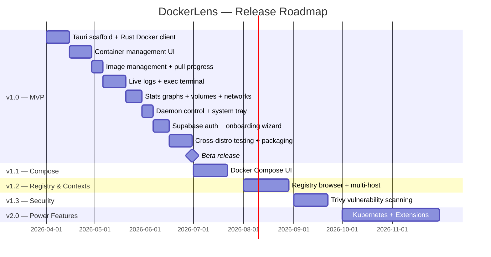

# DockerLens — Product Requirements Document (PRD)

> **Version:** 1.1.0
> **Status:** Active
> **Last Updated:** March 2026
> **License:** MIT — Open Source
> **Maintainer:** [@munene](https://github.com/munene)

---

## Table of Contents

1. [Overview](#1-overview)
2. [Problem Statement](#2-problem-statement)
3. [Goals & Non-Goals](#3-goals--non-goals)
4. [Users & Personas](#4-users--personas)
5. [User Stories](#5-user-stories)
6. [Core Features — MVP](#6-core-features--mvp)
7. [User Flows](#7-user-flows)
8. [System Behaviour](#8-system-behaviour)
9. [Non-Functional Requirements](#9-non-functional-requirements)
10. [Out of Scope — v1.0](#10-out-of-scope--v10)
11. [Roadmap](#11-roadmap)
12. [Open Source Contribution Guide](#12-open-source-contribution-guide)
13. [Glossary](#13-glossary)

---

## 1. Overview

**DockerLens** is a free, open-source, native Linux desktop application that provides a beautiful visual interface for managing Docker — giving Linux users the same polished experience that Windows and Mac users enjoy with Docker Desktop, but built specifically and exclusively for Linux.

It connects directly to the local Docker Engine via the Unix socket (`/var/run/docker.sock`). There is no virtual machine, no background daemon, no cloud dependency, and no paid subscription — ever.

Authentication is **optional** and powered by **Supabase Auth**, which handles GitHub and Google OAuth without requiring DockerLens to run its own auth server. Signed-in users get settings sync across devices. The app works fully offline without an account.
```
┌─────────────────────────────────────────┐
│         DockerLens Application          │
│   React UI  ←→  Rust Core  ←→  Docker  │
│         (Tauri 2.0 — native)            │
└─────────────────────────────────────────┘
         ↕ Unix Socket                ↕ HTTPS (optional)
┌──────────────────────┐    ┌──────────────────────────┐
│   Docker Engine      │    │   Supabase               │
│   (user-installed)   │    │   Auth + Postgres         │
│   Containers · Images│    │   (settings sync)         │
│   Volumes · Networks │    │   GitHub / Google OAuth   │
└──────────────────────┘    └──────────────────────────┘
```

---

## 2. Problem Statement

Linux developers who use Docker face a frustrating reality:

| Problem | Impact |
|---|---|
| Docker Desktop on Linux runs a VM unnecessarily | Wastes memory and CPU — Linux doesn't need a VM to run Docker |
| Docker Desktop requires a paid subscription for teams | Excludes open-source teams and individual developers |
| Docker Desktop conflicts with existing Docker Engine installs | Breaks workflows for developers who installed Docker via `apt`/`dnf` |
| System tray is broken on GNOME and other desktop environments | Core UX feature doesn't work on the most popular Linux DE |
| `host.docker.internal` doesn't resolve on Linux | Breaks local development workflows that rely on it |
| No native Wayland support | Feels like a web port, not a native Linux app |
| CLI-only workflow is steep for newcomers | High barrier to entry for developers new to Docker |

**DockerLens exists to solve all of these problems in a single, focused, native Linux application.**

---

## 3. Goals & Non-Goals

### ✅ Goals

- Provide a **native Linux GUI** for managing Docker containers, images, volumes and networks
- Work on **every major Linux distribution** — Ubuntu, Fedora, Arch, Debian, openSUSE and more
- Connect directly to **Docker Engine via Unix socket** — zero VM, zero overhead
- Be **free and open-source forever** under the MIT license
- Feel like a **first-class Linux citizen** — native Wayland/X11 support, proper system tray, system theme integration
- Allow users to **control the Docker daemon** (start, stop, restart) from the UI — same as Windows/Mac
- Provide a **smart suggestions engine** to help users maintain a healthy Docker environment
- Offer **optional Supabase-powered authentication** (GitHub and Google) for settings sync — fully skippable
- Be **safe for new contributors** — clear code structure, documented decisions, no misleading abstractions

### ❌ Non-Goals

- DockerLens does **not** install Docker Engine — users install it themselves via their package manager
- DockerLens does **not** replace the Docker CLI — it complements it
- DockerLens does **not** manage remote Docker hosts in v1.0 — local only
- DockerLens does **not** include Kubernetes management in v1.0
- DockerLens does **not** bundle a container runtime — it is a pure GUI frontend
- DockerLens is **not** a web application — it is a native desktop binary only
- DockerLens does **not** run its own auth server — Supabase handles all authentication infrastructure
- Authentication is **never required** — every feature works fully without signing in

---

## 4. Users & Personas

### Persona 1 — The Everyday Developer

> **"I use Docker every day but I don't want to memorise every CLI flag."**

- Uses Docker for local development (databases, APIs, services)
- Comfortable with the terminal but prefers a visual overview
- Frustrated that Docker Desktop on Linux feels broken
- Wants to see container status at a glance, tail logs, exec into containers

### Persona 2 — The Linux Enthusiast

> **"I want full control without the bloat."**

- Power user — knows Docker well, uses multiple distros
- Doesn't want a VM running in the background
- Values native performance and small binary size
- Wants rootless Docker support and systemd integration

### Persona 3 — The Open Source Contributor

> **"I want to contribute but I need to understand what I'm building."**

- Developer interested in Rust, Tauri, or React
- Wants clear documentation, labelled issues and a welcoming codebase
- Needs to understand architecture decisions before contributing
- Relies on the PRD and TRD to understand what's already decided

### Persona 4 — The Docker Newcomer

> **"I understand containers conceptually but the CLI is overwhelming."**

- Recently moved to Linux from Windows or Mac
- Used Docker Desktop on their previous OS — expects a similar experience
- Needs onboarding guidance and clear feedback from the UI

---

## 5. User Stories

### Onboarding

| ID | User Story | Priority |
|---|---|---|
| US-01 | As a new user, I want the app to detect if Docker Engine is installed so I know what to do next | 🔴 Must |
| US-02 | As a new user, I want distro-specific install instructions shown inside the app if Docker is missing | 🔴 Must |
| US-03 | As a new user, I want the app to check if I'm in the `docker` group and show me the fix if not | 🔴 Must |
| US-04 | As a new user, I want to optionally sign in with GitHub or Google via Supabase to sync my settings across devices | 🟡 Should |
| US-05 | As a new user, I want to skip sign-in entirely and use the app fully offline without any account | 🔴 Must |

### Authentication & Settings Sync

| ID | User Story | Priority |
|---|---|---|
| US-06 | As a signed-in user, I want my app preferences (theme, socket path, notifications) to sync across my devices via Supabase | 🟡 Should |
| US-07 | As a signed-in user, I want to sign out from the Settings screen and return to offline mode | 🟡 Should |
| US-08 | As a user, I want the app to show clearly that authentication is optional and never blocks core features | 🔴 Must |

### Container Management

| ID | User Story | Priority |
|---|---|---|
| US-09 | As a developer, I want to see all my containers (running, stopped, paused) in one list | 🔴 Must |
| US-10 | As a developer, I want to start, stop, restart and delete containers without opening a terminal | 🔴 Must |
| US-11 | As a developer, I want to tail live logs from any container inside the app | 🔴 Must |
| US-12 | As a developer, I want to exec into a container shell from inside the app | 🔴 Must |
| US-13 | As a developer, I want to see real-time CPU, memory and network stats for running containers | 🔴 Must |
| US-14 | As a developer, I want to see ports, environment variables, mounts and labels for any container | 🔴 Must |
| US-15 | As a developer, I want to open a container's exposed port directly in my browser | 🟡 Should |

### Image Management

| ID | User Story | Priority |
|---|---|---|
| US-16 | As a developer, I want to list all local images with their size, tag and creation date | 🔴 Must |
| US-17 | As a developer, I want to pull any image by name and tag with a real-time progress bar | 🔴 Must |
| US-18 | As a developer, I want to run a container from any image using a guided wizard | 🔴 Must |
| US-19 | As a developer, I want to delete unused images to free disk space | 🔴 Must |

### Volumes & Networks

| ID | User Story | Priority |
|---|---|---|
| US-20 | As a developer, I want to see all volumes, their size, mount path and which containers use them | 🔴 Must |
| US-21 | As a developer, I want to create and delete volumes from the UI | 🔴 Must |
| US-22 | As a developer, I want to see all networks, their subnets and which containers are connected | 🔴 Must |
| US-23 | As a developer, I want to create and remove custom networks | 🔴 Must |

### Daemon Control

| ID | User Story | Priority |
|---|---|---|
| US-24 | As a Linux user, I want to start the Docker daemon from the UI without opening a terminal | 🔴 Must |
| US-25 | As a Linux user, I want to stop and restart the Docker daemon from the UI | 🔴 Must |
| US-26 | As a Linux user, I want to toggle "Start Docker on Login" from the Settings screen | 🔴 Must |
| US-27 | As a rootless Docker user, I want all daemon controls to work without requiring a password | 🔴 Must |

### System Tray & Notifications

| ID | User Story | Priority |
|---|---|---|
| US-28 | As a developer, I want the app to minimise to the system tray rather than quit when I close it | 🔴 Must |
| US-29 | As a developer, I want the tray icon to show green when Docker is running and red when stopped | 🔴 Must |
| US-30 | As a developer, I want a desktop notification when a container crashes unexpectedly | 🟡 Should |

### Suggestions Engine

| ID | User Story | Priority |
|---|---|---|
| US-31 | As a developer, I want the app to suggest cleanup actions (stopped containers, unused images, orphaned volumes) | 🟡 Should |
| US-32 | As a developer, I want to dismiss suggestions I don't want to act on | 🟡 Should |
| US-33 | As a developer, I want suggestions to link directly to the relevant screen | 🟡 Should |

---

## 6. Core Features — MVP

### Feature 1 — Onboarding Wizard

A 4-step first-run wizard that guides users from zero to a connected, running DockerLens.
```
Step 1: Welcome         → Feature highlights, app overview
Step 2: Sign In         → Optional — GitHub or Google via Supabase Auth
                          "Skip for now" always visible
Step 3: System Check    → Auto-detect Docker, group membership, socket, daemon
Step 4: Ready           → Summary of detected resources, launch button
```

The wizard auto-detects the user's Linux distro from `/etc/os-release` and shows tailored install instructions if Docker Engine is not found.

---

### Feature 2 — Authentication (Optional — Supabase)

Authentication is a fully optional layer. Every feature in DockerLens works without an account. Signing in unlocks settings sync across devices.

**Provider:** Supabase Auth
**Methods:** GitHub OAuth, Google OAuth
**Storage:** Supabase Postgres (user preferences only — no Docker data is ever sent to the cloud)

**What syncs when signed in:**

| Setting | Synced |
|---|---|
| Theme (dark / light / system) | ✅ |
| Docker socket path override | ✅ |
| Notification preferences | ✅ |
| Start on login preference | ✅ |
| Dismissed suggestions | ✅ |

**What never leaves the machine:**

| Data | Stays local |
|---|---|
| Container names and IDs | ✅ Always local |
| Image names and tags | ✅ Always local |
| Volume data | ✅ Always local |
| Container logs | ✅ Always local |
| Docker socket credentials | ✅ Always local |

---

### Feature 3 — Container Management

The primary view. A split-panel layout with a container list on the left and a detail panel on the right.

**Container List**
- Live status badges: running 🟢 / stopped 🔴 / paused 🟡
- Inline CPU%, memory and uptime for running containers
- Search and filter

**Container Detail Panel — 5 tabs**

| Tab | Content |
|---|---|
| Overview | Ports, environment variables, volume mounts, labels, network, image |
| Logs | Live `stdout`/`stderr` stream via `GET /containers/{id}/logs?follow=true` |
| Terminal | Full interactive shell via `POST /containers/{id}/exec` + WebSocket |
| Stats | Real-time CPU, memory and network I/O graphs |
| Inspect | Raw Docker inspect JSON |

---

### Feature 4 — Image Management

Table view of all local images. Pull with per-layer progress streaming. Run wizard for new containers.

**Run Wizard — 5 steps**
```
Step 1: Container name
Step 2: Port mappings       (HOST:CONTAINER pairs)
Step 3: Environment vars    (KEY=VALUE pairs)
Step 4: Volume mounts       (/host/path:/container/path)
Step 5: Restart policy      (always / on-failure / no)
```

---

### Feature 5 — Volumes

Stats row (total, used, unused) + expandable cards per volume showing mount path, driver, size and attached containers. Unused volumes get a "Remove" button.

---

### Feature 6 — Networks

Stats row + expandable cards per network showing subnet, gateway, driver and connected containers with live status dots. Built-in networks (bridge, host, none) are labelled and cannot be deleted.

---

### Feature 7 — Docker Daemon Control

Full daemon lifecycle management from the Settings screen — matching the Windows and Mac Docker Desktop experience.

| Action | Command | Privilege |
|---|---|---|
| Start Docker | `systemctl start docker` | Polkit (root) / none (rootless) |
| Stop Docker | `systemctl stop docker` | Polkit (root) / none (rootless) |
| Restart Docker | `systemctl restart docker` | Polkit (root) / none (rootless) |
| Enable on boot | `systemctl enable docker` | Polkit (root) / none (rootless) |
| Disable on boot | `systemctl disable docker` | Polkit (root) / none (rootless) |

Root Docker uses Polkit for native OS password prompts. Rootless Docker requires no elevation at all.

---

### Feature 8 — Suggestions Engine

A smart recommendations panel that analyses the local Docker environment and surfaces actionable suggestions.

**Built-in suggestion types:**

| Type | Trigger | Action |
|---|---|---|
| Stopped container | Container stopped > 24h | Start or remove |
| Unused image layers | Dangling images detected | Run `image prune` |
| Orphaned volume | Volume with no containers | Remove |
| CPU spike | Container CPU > threshold | View stats |
| Image update available | Newer tag exists on registry | Pull update |

Each suggestion has a severity (warning / info / success), a description, a one-click action and a dismiss button. Dismissed suggestions move to a "Resolved" section.

---

### Feature 9 — System Tray

- Minimises to tray on window close — does not quit
- Tray icon: 🟢 daemon running / 🔴 daemon stopped
- Right-click menu: Open app, running container count, Start All / Stop All, Quit
- Background polling every 10 seconds for state changes
- Desktop notification on container crash

---

## 7. User Flows

### Flow 1 — First Launch


---

### Flow 2 — Supabase Auth Deep Link Return


---

### Flow 3 — Container Lifecycle


---

### Flow 4 — Daemon Control


---

### Flow 5 — Image Pull & Run


---

## 8. System Behaviour

### Socket Auto-Detection

When DockerLens starts, it searches for the Docker socket in this order:
```
1. /var/run/docker.sock          ← standard root Docker
2. ~/.docker/run/docker.sock     ← rootless Docker
3. /run/user/{UID}/docker.sock   ← rootless alternative
4. $DOCKER_HOST env variable     ← custom path
5. → First-run wizard if none found
```

### Supabase Auth — Deep Link Handling

Supabase OAuth redirects back to the app via a custom URI scheme registered with the OS:
```
dockerlens://auth/callback#access_token=...&refresh_token=...
```

Tauri intercepts this deep link, passes it to `supabase-js` on the React side, and the session is stored securely in local storage. No tokens are ever sent to any server other than Supabase.

### Settings Sync Behaviour

| State | Behaviour |
|---|---|
| Signed in + online | Preferences load from Supabase on startup, save on change |
| Signed in + offline | Last-synced preferences used from local cache |
| Signed out | All preferences stored locally only |
| First sign-in | Local preferences merged into Supabase as initial state |

### Auto-Reconnect

If the Docker daemon stops while DockerLens is open, the app retries the socket connection every 5 seconds. The tray icon turns red and a banner is shown in the UI. When the daemon comes back, the app reconnects silently and reloads all data.

### Cross-Distro Support

| Challenge | Solution |
|---|---|
| Socket path varies | Auto-detection waterfall (above) |
| Package manager differs | Detect distro via `/etc/os-release` |
| Polkit availability | Fallback to `pkexec` if Polkit unavailable |
| Systemd vs other init | Check for systemd first, show manual instructions if absent |
| Wayland vs X11 | Tauri 2.0 handles both natively |
| GNOME system tray | Detect AppIndicator extension, prompt user if missing |

---

## 9. Non-Functional Requirements

| Requirement | Target |
|---|---|
| App launch time | < 2 seconds on mid-range hardware |
| Log stream latency | < 50ms end-to-end |
| Memory at idle | < 120 MB |
| Binary size | < 15 MB (.AppImage) |
| Supported distros | Ubuntu 22.04+, Fedora 39+, Arch, Debian 12, openSUSE |
| Display servers | X11 and Wayland |
| Docker API version | v1.41+ |
| Accessibility | Keyboard navigable, screen reader friendly labels |
| Offline support | Full functionality without internet (auth and sync are optional) |
| Auth provider | Supabase (hosted) — no self-hosted auth infrastructure required |
| Data privacy | No Docker data (containers, images, logs) ever leaves the local machine |

---

## 10. Out of Scope — v1.0

The following features are explicitly **not** part of the v1.0 release. They are planned for future versions. Contributors should not begin work on these without prior discussion.

| Feature | Target Version | Reason deferred |
|---|---|---|
| Docker Compose UI | v1.1 | Adds significant scope — separate milestone |
| Docker Hub / GHCR registry browser | v1.2 | Requires auth flow and search API integration |
| Multi-host Docker context support | v1.2 | Remote connection handling increases complexity |
| Image vulnerability scanning (Trivy) | v1.3 | Separate binary dependency |
| Kubernetes cluster management | v2.0 | Entirely separate domain — major scope |
| Extensions marketplace | v2.0 | Requires plugin system architecture |
| Dev Environments | v2.0 | Complex lifecycle management |
| Windows / macOS support | Unplanned | DockerLens is Linux-first by design |
| Self-hosted Supabase | Unplanned | Hosted Supabase covers all needs for v1.0 |

---

## 11. Roadmap


---

## 12. Open Source Contribution Guide

DockerLens is open-source under the MIT license. We welcome contributions of all kinds. Before contributing, please read this section carefully — it will save you time and help us keep the project moving forward cleanly.

### What's Decided vs. What's Open

| Status | Meaning | Examples |
|---|---|---|
| ✅ Decided | Architecture, stack, scope — do not change without discussion | Tauri + Rust + React, Supabase Auth, MIT license, Linux-only |
| 🟡 Open for input | Implementation details, UI patterns, Rust API design | Component structure, error handling strategy |
| 🆓 Contributions welcome | Bug fixes, tests, docs, new suggestions, distro support | Any `good first issue` label |

### Branch & Commit Convention
```
feat:     New feature
fix:      Bug fix
docs:     Documentation only
chore:    Build, deps, CI changes
test:     Test additions or changes
refactor: Code change with no feature or fix
```

Example: `feat: add volume pruning from volumes view`

### Good First Issues

Look for issues tagged `good first issue` on GitHub. These are well-scoped tasks with clear acceptance criteria — ideal for new contributors getting familiar with the codebase.

### Before Opening a PR

- [ ] Read the TRD to understand the technology decisions already made
- [ ] Check that the feature you want to build is in scope for the current milestone
- [ ] Open an issue first if you're planning a large change — discuss before building
- [ ] Run `pnpm tauri dev` and confirm the app builds locally
- [ ] Run `cargo clippy` — no warnings allowed in PRs

### Need Help?

Open a GitHub Discussion in the `Q&A` category. We are a welcoming community — there are no stupid questions.

---

## 13. Glossary

| Term | Definition |
|---|---|
| **Docker Engine** | The daemon (`dockerd`) that runs containers on Linux. Users install this separately via their package manager. |
| **Unix socket** | The file at `/var/run/docker.sock` that Docker Engine listens on for API requests. DockerLens communicates with Docker exclusively through this socket. |
| **Tauri** | The Rust-based framework used to build native desktop applications with a web-based UI (React). Replaces Electron with a much smaller binary. |
| **bollard** | The Rust crate (library) used to communicate with the Docker Engine REST API. |
| **Rootless Docker** | A Docker setup where `dockerd` runs as a regular user, not root. More secure. Uses `~/.docker/run/docker.sock` instead of `/var/run/docker.sock`. |
| **Polkit** | Linux's built-in privilege escalation system. Used by DockerLens to run `systemctl start/stop docker` with a native OS password dialog — no `sudo` in a terminal. |
| **IPC** | Inter-Process Communication. In Tauri, this is the bridge between the React frontend and the Rust backend via `invoke()`. |
| **AppImage** | A universal Linux application format that runs on any distro with glibc 2.31+, with no installation required. |
| **Supabase** | An open-source Firebase alternative providing a hosted Postgres database, authentication, and real-time subscriptions. Used by DockerLens for optional auth and settings sync. |
| **Supabase Auth** | The authentication module within Supabase. Handles GitHub and Google OAuth flows without DockerLens running its own auth server. |
| **supabase-js** | The official JavaScript/TypeScript client library for Supabase. Used on the React side of the Tauri app to manage auth sessions and sync preferences. |
| **JWT** | JSON Web Token. A signed token issued by Supabase after successful OAuth. Stored locally and used to authenticate requests to the Supabase Postgres database. |
| **OAuth** | Open Authorization. The standard protocol used by GitHub and Google to allow users to sign in to DockerLens without sharing their password. |
| **Deep link** | A custom URI scheme (`dockerlens://`) registered with the OS that allows the system browser to redirect back to the Tauri app after OAuth completes. |
| **PRD** | Product Requirements Document. This file. Describes what to build and why. |
| **TRD** | Technical Requirements Document. Describes how to build it — languages, libraries, architecture decisions. |