# DockerLens — Technical Requirements Document (TRD)

> **Version:** 1.0.0
> **Status:** Active
> **Last Updated:** March 2026
> **License:** MIT — Open Source
> **Maintainer:** [@munene](https://github.com/munene)
> **PRD Reference:** `docs/requirements/PRD.md v1.1.0`

---

## Table of Contents

1. [Purpose](#1-purpose)
2. [System Architecture](#2-system-architecture)
3. [Tech Stack](#3-tech-stack)
4. [Repository Structure](#4-repository-structure)
5. [Frontend — React + TypeScript](#5-frontend--react--typescript)
6. [Backend — Rust Core](#6-backend--rust-core)
7. [Docker API Integration](#7-docker-api-integration)
8. [Authentication — Supabase](#8-authentication--supabase)
9. [Daemon Control](#9-daemon-control)
10. [Real-Time Streaming](#10-real-time-streaming)
11. [Cross-Distro Compatibility](#11-cross-distro-compatibility)
12. [Packaging & Distribution](#12-packaging--distribution)
13. [CI/CD Pipeline](#13-cicd-pipeline)
14. [Security Considerations](#14-security-considerations)
15. [Development Setup](#15-development-setup)
16. [Dependency Reference](#16-dependency-reference)
17. [Glossary](#17-glossary)

---

## 1. Purpose

This document defines the **technical implementation** of every requirement in the DockerLens PRD. Where the PRD answers *what* to build, the TRD answers *how* to build it.

Every section in this document maps directly to PRD user stories (`US-xx`) and features. Contributors should read both documents before starting work.

### How PRD and TRD Relate
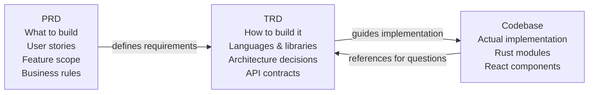

---

## 2. System Architecture

### 2.1 High-Level Architecture
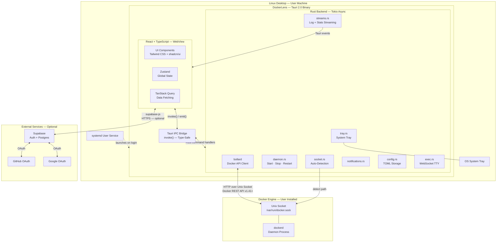

### 2.2 IPC Communication Model

The React frontend and Rust backend communicate exclusively through Tauri's IPC bridge. There is no HTTP server, no WebSocket server exposed to the outside, and no shared memory. All communication is:

- **Frontend → Backend:** `invoke("command_name", { args })` — returns a `Promise`
- **Backend → Frontend:** `emit("event_name", payload)` — fires on the Rust event emitter, received by `listen()` in React
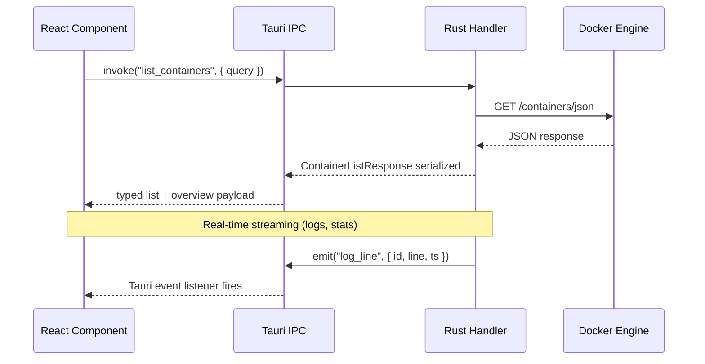

---

## 3. Tech Stack

### 3.1 Decision Summary

All technology decisions below are **final for v1.0**. Changes require a discussion issue opened on GitHub before any implementation begins.
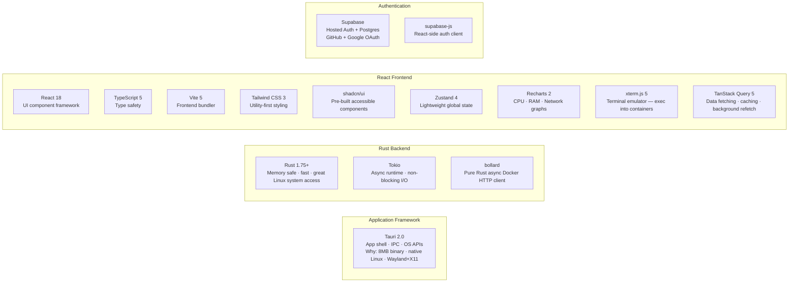

### 3.2 Full Stack Table

| Layer | Technology | Version | Purpose | PRD Reference |
|---|---|---|---|---|
| App framework | Tauri | 2.0 | Native window, OS APIs, IPC bridge | All |
| Backend language | Rust | 1.75+ | Docker client, system integration | All |
| Async runtime | Tokio | latest | Non-blocking I/O, stream processing | US-11, US-13 |
| Docker client | bollard | 0.17+ | Docker Engine REST API over Unix socket | US-09 to US-23 |
| Frontend framework | React | 18 | All visual components | All |
| Frontend language | TypeScript | 5.x | Type safety across all UI code | All |
| Bundler | Vite | 5.x | Frontend build tool (used with Tauri) | All |
| Styling | Tailwind CSS | 3.x | Utility-first CSS | All |
| Component library | shadcn/ui | latest | Accessible pre-built components | All |
| Global state | Zustand | 4.x | Lightweight store, no boilerplate | All |
| Data fetching | TanStack Query | 5.x | Caching, background refetch | All |
| Terminal | xterm.js | 5.x | Exec into containers | US-12 |
| Charts | Recharts | 2.x | CPU, RAM, network I/O graphs | US-13 |
| Icons | Lucide React | latest | Consistent icon set | All |
| Auth provider | Supabase | cloud | GitHub + Google OAuth, Postgres | US-04, US-06, US-07 |
| Auth client | supabase-js | 2.x | React-side session management | US-04, US-06 |
| Package manager | pnpm | 10.x | Frontend dependency management | All |
| Rust package manager | cargo | 1.75+ | Rust dependency management | All |

---

## 4. Repository Structure
```
dockerlens/                              ← single git repository
│
├── src/                                 ← React + TypeScript (WebView UI)
│   ├── components/
│   │   ├── layout/
│   │   │   ├── Sidebar.tsx              ← Nav, daemon pill, user pill
│   │   │   ├── TopBar.tsx               ← Screen title + actions
│   │   │   └── TitleBar.tsx             ← Traffic lights + window title
│   │   ├── containers/
│   │   │   ├── ContainerList.tsx
│   │   │   ├── ContainerDetail.tsx
│   │   │   ├── LogsTab.tsx              ← xterm.js live log stream
│   │   │   ├── TerminalTab.tsx          ← xterm.js exec shell
│   │   │   ├── StatsTab.tsx             ← Recharts graphs
│   │   │   ├── OverviewTab.tsx
│   │   │   └── InspectTab.tsx
│   │   ├── images/
│   │   │   ├── ImageList.tsx
│   │   │   ├── PullModal.tsx            ← Layer progress bar
│   │   │   └── RunWizard.tsx            ← 5-step container config
│   │   ├── volumes/
│   │   │   ├── VolumeList.tsx
│   │   │   └── VolumeCard.tsx           ← Expandable detail card
│   │   ├── networks/
│   │   │   ├── NetworkList.tsx
│   │   │   └── NetworkCard.tsx          ← Expandable detail card
│   │   ├── recommendations/
│   │   │   ├── RecommendationList.tsx
│   │   │   └── RecommendationCard.tsx
│   │   └── onboarding/
│   │       ├── OnboardingWizard.tsx
│   │       ├── WelcomeStep.tsx
│   │       ├── AuthStep.tsx             ← Supabase GitHub + Google
│   │       ├── SystemCheckStep.tsx
│   │       └── ReadyStep.tsx
│   │
│   ├── pages/
│   │   ├── DashboardPage.tsx
│   │   ├── ContainersPage.tsx
│   │   ├── ImagesPage.tsx
│   │   ├── VolumesPage.tsx
│   │   ├── NetworksPage.tsx
│   │   ├── ComposePage.tsx
│   │   ├── SettingsPage.tsx
│   │   └── RecommendationsPage.tsx
│   │
│   ├── store/
│   │   ├── containers.store.ts          ← Zustand container slice
│   │   ├── images.store.ts
│   │   ├── app.store.ts                 ← daemon status, screen state
│   │   └── auth.store.ts                ← Supabase session
│   │
│   ├── hooks/
│   │   ├── useContainers.ts             ← TanStack Query hooks
│   │   ├── useDockerStats.ts
│   │   ├── useTauriEvents.ts            ← listen() wrapper
│   │   └── useSupabase.ts               ← auth session hook
│   │
│   ├── lib/
│   │   ├── tauri.ts                     ← invoke() typed wrappers
│   │   └── supabase.ts                  ← supabase-js client init
│   │
│   └── main.tsx                         ← React entry point
│
├── src-tauri/                           ← Rust backend
│   ├── src/
│   │   ├── main.rs                      ← Tauri app bootstrap
│   │   ├── commands.rs                  ← all #[tauri::command] exports
│   │   │
│   │   ├── docker/
│   │   │   ├── mod.rs
│   │   │   ├── client.rs                ← bollard client singleton
│   │   │   ├── containers.rs            ← list query, overview, detail, lifecycle, bulk actions, inspect, stats snapshot
│   │   │   ├── images.rs                ← list, pull, delete
│   │   │   ├── volumes.rs               ← list, create, delete
│   │   │   ├── networks.rs              ← list, create, delete
│   │   │   ├── exec.rs                  ← WebSocket TTY exec session
│   │   │   └── streams.rs               ← log tail + stats streaming
│   │   │
│   │   └── system/
│   │       ├── mod.rs
│   │       ├── socket.rs                ← socket auto-detection
│   │       ├── daemon.rs                ← start/stop/restart/enable
│   │       ├── tray.rs                  ← system tray icon + menu
│   │       ├── notifications.rs         ← desktop notifications
│   │       ├── config.rs                ← TOML config read/write
│   │       └── updater.rs               ← GitHub Releases auto-update
│   │
│   ├── Cargo.toml                       ← Rust dependencies
│   ├── Cargo.lock                       ← committed — reproducible builds
│   ├── build.rs
│   └── tauri.conf.json                  ← app name, window, permissions
│
├── docs/
│   ├── requirements/
│   │   ├── PRD.md                       ← Product Requirements Document
│   │   └── TRD.md                       ← This file
│   ├── architecture/                    ← Figma exports, system diagrams
│   └── design/                          ← UI specs, design tokens, mockups
│
├── .github/
│   ├── workflows/
│   │   └── build.yml                    ← CI/CD pipeline
│   └── dependabot.yml
│
├── package.json
├── pnpm-lock.yaml
├── vite.config.ts
├── tailwind.config.ts
├── tsconfig.json
├── .gitignore
└── README.md
```

---

## 5. Frontend — React + TypeScript

### 5.1 Component Architecture
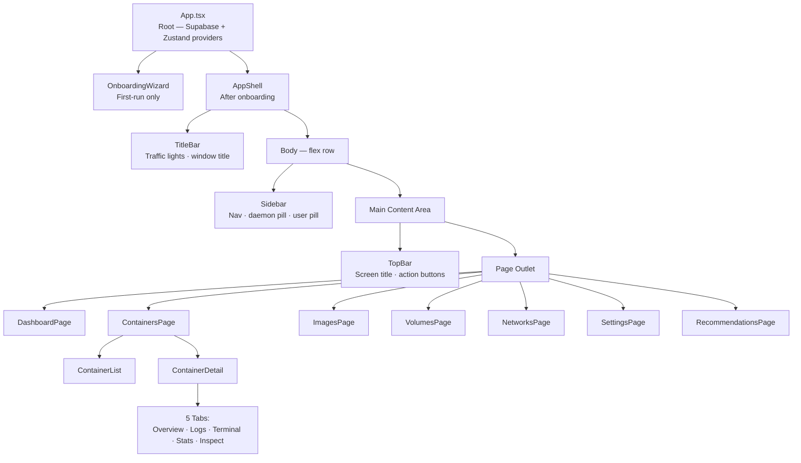

### 5.2 State Management

Zustand is used for global client state. TanStack Query is used for all server (Docker API) state.

| Store | Contents | Technology |
|---|---|---|
| `app.store.ts` | Current screen, daemon status, socket path | Zustand |
| `containers.store.ts` | Selected container, active tab | Zustand |
| `auth.store.ts` | Supabase session, user object | Zustand |
| Docker data (containers, images, etc.) | Live data from Docker Engine | TanStack Query |

### 5.3 Tauri invoke() Typed Wrappers

All IPC calls are wrapped in `src/lib/tauri.ts` for type safety. No raw `invoke()` calls in components.
```typescript
// src/lib/tauri.ts
import { invoke } from '@tauri-apps/api/core';
import type {
  ContainerDetail,
  ContainerListQuery,
  ContainerListResponse,
  ContainersOverviewSummary,
} from '@/types';

export const docker = {
  listContainers: (query: ContainerListQuery) =>
    invoke<ContainerListResponse>('list_containers', { query }),

  getContainersOverview: () =>
    invoke<ContainersOverviewSummary>('get_containers_overview'),

  getContainerDetail: (id: string) =>
    invoke<ContainerDetail>('get_container_detail', { id }),

  startContainer: (id: string) =>
    invoke<void>('start_container', { id }),

  stopContainer: (id: string) =>
    invoke<void>('stop_container', { id }),

  pullImage: (name: string, tag: string) =>
    invoke<void>('pull_image', { name, tag }),

  startDaemon: () =>
    invoke<void>('start_docker_daemon'),

  stopDaemon: () =>
    invoke<void>('stop_docker_daemon'),
};
```

### 5.4 Real-Time Event Listeners

Live updates from Rust (log lines, stats, daemon state) are received via Tauri events.
```typescript
// src/hooks/useTauriEvents.ts
import { listen } from '@tauri-apps/api/event';
import { useEffect } from 'react';

export function useLogStream(containerId: string, onLine: (line: string) => void) {
  useEffect(() => {
    const unlisten = listen<{ id: string; line: string }>('log_line', (event) => {
      if (event.payload.id === containerId) {
        onLine(event.payload.line);
      }
    });
    return () => { unlisten.then(fn => fn()); };
  }, [containerId]);
}

export function useDaemonStatus(onChange: (running: boolean) => void) {
  useEffect(() => {
    const unlisten = listen<{ running: boolean }>('daemon_state', (event) => {
      onChange(event.payload.running);
    });
    return () => { unlisten.then(fn => fn()); };
  }, []);
}
```

---

## 6. Backend — Rust Core

### 6.1 Module Dependency Map
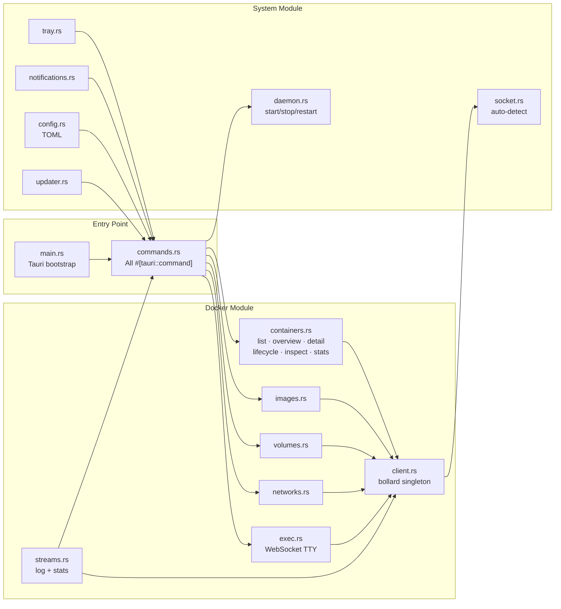

### 6.2 Phase 2 Container Backend Contract

Phase 2 must expose a stable container-management contract from Rust to the frontend. The frontend should consume DockerLens DTOs, not raw bollard models and not raw Docker JSON, except on the dedicated Inspect surface.

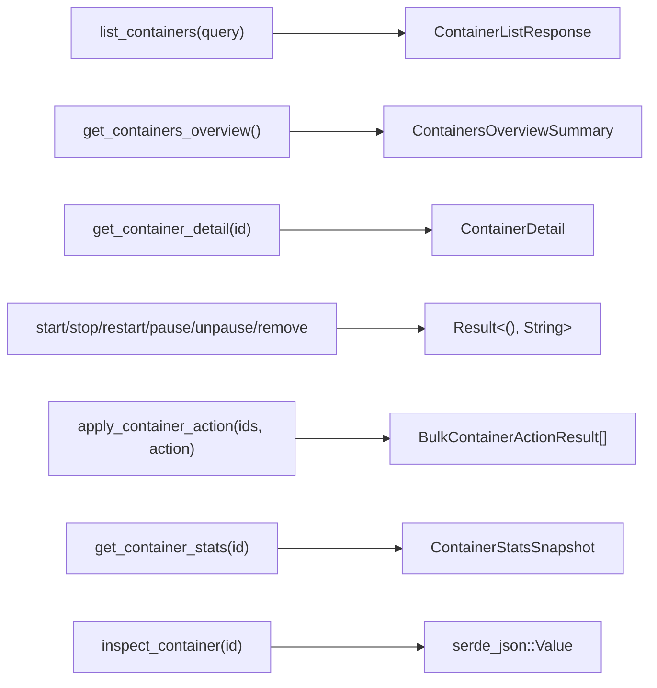

#### Required container DTOs

- `ContainerListQuery`
- `ContainerListResponse`
- `ContainerListItem`
- `ContainersOverviewSummary`
- `ContainerDetail`
- `ContainerActionCapabilities`
- `ContainerStatsSnapshot`
- `BulkContainerActionResult`
- `PortBinding`, `MountInfo`, `NetworkAttachment`, `PlatformInfo`, `KeyValue`

#### Contract rules

- `list_containers(query)` is the main table source and must support search plus `only_running`
- `get_containers_overview()` powers the summary area above the table
- `get_container_detail(id)` powers the main detail panel and must not require frontend parsing of raw inspect JSON
- `inspect_container(id)` remains available for debug / raw Inspect views only
- `get_container_stats(id)` returns one-shot snapshot data in Phase 2; Phase 6 streams the same conceptual model live
- bulk lifecycle actions should return per-item results so partial success is representable

#### Implementation notes

- commands return `Result<T, String>` as required by Tauri
- enrichment must be fail-soft: if stats or inspect data is temporarily unavailable, the row/detail still returns with partial data
- inspect/stats fan-out must use bounded concurrency for larger installations
- capability calculation (`can_start`, `can_stop`, etc.) must be centralized in Rust so the frontend only renders valid actions

```rust
#[tauri::command]
pub async fn list_containers(
    query: ContainerListQuery,
    docker: State<'_, DockerClient>,
) -> Result<ContainerListResponse, String>;

#[tauri::command]
pub async fn get_containers_overview(
    docker: State<'_, DockerClient>,
) -> Result<ContainersOverviewSummary, String>;

#[tauri::command]
pub async fn get_container_detail(
    id: String,
    docker: State<'_, DockerClient>,
) -> Result<ContainerDetail, String>;
```

### 6.3 bollard Client Singleton

The bollard client is initialised once at app start and stored as Tauri managed state, shared across all command handlers.
```rust
// src-tauri/src/docker/client.rs

use bollard::Docker;

pub struct DockerClient {
    inner: Docker,
}

impl DockerClient {
    pub fn connect(socket_path: &str) -> Result<Self, bollard::errors::Error> {
        let inner = Docker::connect_with_unix(
            socket_path,
            120,
            bollard::API_DEFAULT_VERSION,
        )?;
        Ok(Self { inner })
    }
}
```

---

## 7. Docker API Integration

### 7.1 API Endpoint Map

Every PRD feature maps to one or more Docker REST API endpoints. All are called over the Unix socket via bollard.

| Feature | Method | Endpoint | PRD Reference |
|---|---|---|---|
| List containers | `GET` | `/containers/json?all=true` | US-09 |
| Detail enrichment / inspect-backed detail | `GET` | `/containers/{id}/json` | US-14 |
| Start container | `POST` | `/containers/{id}/start` | US-10 |
| Stop container | `POST` | `/containers/{id}/stop` | US-10 |
| Restart container | `POST` | `/containers/{id}/restart` | US-10 |
| Pause container | `POST` | `/containers/{id}/pause` | US-10 |
| Unpause container | `POST` | `/containers/{id}/unpause` | US-10 |
| Remove container | `DELETE` | `/containers/{id}?force=true` | US-10 |
| One-shot container stats | `GET` | `/containers/{id}/stats?stream=false&one-shot=true` | US-13 |
| Live logs | `GET` | `/containers/{id}/logs?follow=true&stdout=true&stderr=true` | US-11 |
| Exec create | `POST` | `/containers/{id}/exec` | US-12 |
| Exec start (WebSocket) | `POST` | `/exec/{id}/start` | US-12 |
| Container stats | `GET` | `/containers/{id}/stats?stream=true` | US-13 |
| Container inspect | `GET` | `/containers/{id}/json` | US-14 |
| List images | `GET` | `/images/json` | US-16 |
| Pull image | `POST` | `/images/create?fromImage={name}&tag={tag}` | US-17 |
| Delete image | `DELETE` | `/images/{name}` | US-19 |
| List volumes | `GET` | `/volumes` | US-20 |
| Create volume | `POST` | `/volumes/create` | US-21 |
| Delete volume | `DELETE` | `/volumes/{name}` | US-21 |
| List networks | `GET` | `/networks` | US-22 |
| Create network | `POST` | `/networks/create` | US-23 |
| Delete network | `DELETE` | `/networks/{id}` | US-23 |
| Docker system info | `GET` | `/info` | Dashboard |
| Docker events stream | `GET` | `/events` | Tray, suggestions |

### 7.2 Snapshot-First Phase 2 Architecture

Phase 2 should build on snapshot DTOs that can later be streamed in Phase 6 without redesigning the frontend/backend contract.

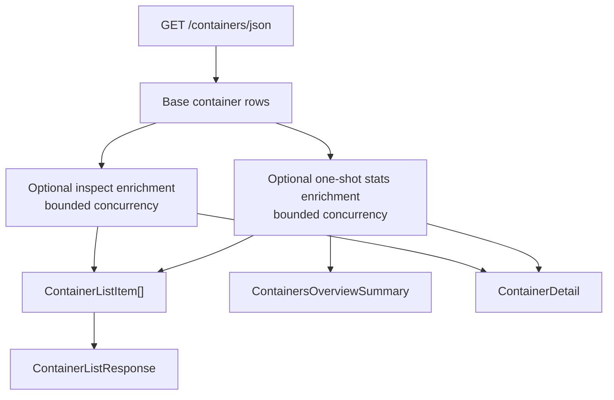

Rules:

- list loading must succeed even if some enrichment calls fail
- stats snapshot freshness must be explicit in the DTO
- raw inspect JSON is a separate path from typed detail
- capability metadata should be calculated in Rust and returned with list/detail payloads

### 7.3 Streaming Architecture

Log streaming, stats streaming and event streaming all follow the same pattern — an async Tokio task reads from bollard's stream and emits Tauri events line by line.
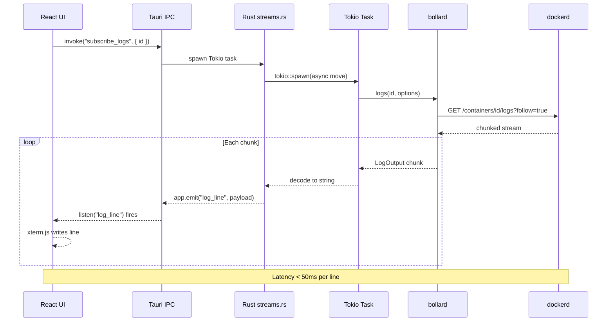

---

## 8. Authentication — Supabase

### 8.1 Auth Flow Architecture
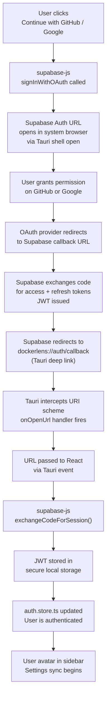

### 8.2 Supabase Client Initialisation
```typescript
// src/lib/supabase.ts
import { createClient } from '@supabase/supabase-js';

const SUPABASE_URL = import.meta.env.VITE_SUPABASE_URL;
const SUPABASE_ANON_KEY = import.meta.env.VITE_SUPABASE_ANON_KEY;

export const supabase = createClient(SUPABASE_URL, SUPABASE_ANON_KEY, {
  auth: {
    flowType: 'pkce',            // required for desktop OAuth
    detectSessionInUrl: true,
    persistSession: true,
    storage: window.localStorage,
  },
});
```

### 8.3 Deep Link Registration

Tauri must register a custom URI scheme so the OS can redirect the browser back to the app after OAuth.
```json
// src-tauri/tauri.conf.json (relevant section)
{
  "app": {
    "security": {
      "deepLinkProtocols": ["dockerlens"]
    }
  }
}
```
```rust
// src-tauri/src/main.rs (deep link handler)
tauri::Builder::default()
    .plugin(tauri_plugin_deep_link::init())
    .setup(|app| {
        app.listen("deep-link://new-url", |event| {
            // Forward URL to React for supabase-js to process
            app.emit("auth-callback", event.payload()).ok();
        });
        Ok(())
    })
```

### 8.4 Settings Sync Schema

Only user preferences are stored in Supabase. No Docker data ever leaves the machine.
```sql
-- Supabase Postgres schema
CREATE TABLE user_preferences (
  id          UUID PRIMARY KEY REFERENCES auth.users(id) ON DELETE CASCADE,
  theme       TEXT DEFAULT 'dark',         -- 'dark' | 'light' | 'system'
  socket_path TEXT DEFAULT '',             -- custom socket path override
  notifs_on   BOOLEAN DEFAULT true,        -- desktop notifications
  start_on_login BOOLEAN DEFAULT true,
  dismissed_suggestions TEXT[] DEFAULT '{}', -- array of dismissed IDs
  updated_at  TIMESTAMPTZ DEFAULT now()
);

-- Row Level Security — users can only access their own row
ALTER TABLE user_preferences ENABLE ROW LEVEL SECURITY;
CREATE POLICY "own_preferences" ON user_preferences
  USING (auth.uid() = id);
```

### 8.5 Offline-First Behaviour

| Scenario | Behaviour |
|---|---|
| Not signed in | All preferences stored in TOML config (`~/.config/dockerlens/config.toml`) |
| Signed in + online | Preferences loaded from Supabase on startup, saved on change |
| Signed in + offline | Last-synced preferences used from local TOML cache |
| First sign-in | Local TOML preferences uploaded to Supabase as initial state |
| Sign-out | Supabase session cleared, preferences remain in TOML locally |

---

## 9. Daemon Control

### 9.1 Implementation

The daemon module detects whether the user is running root or rootless Docker and chooses the correct systemctl invocation. Polkit (`pkexec`) handles privilege escalation for root Docker without requiring a terminal.
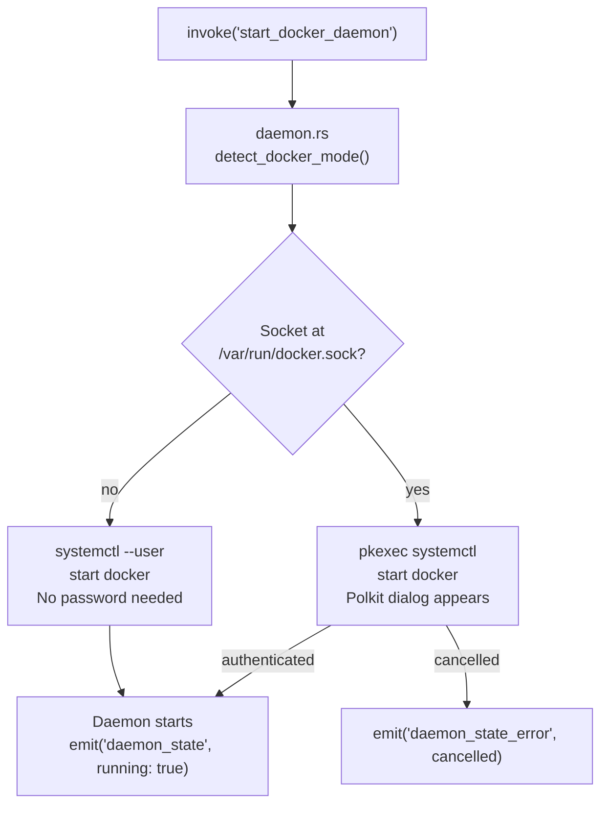
```rust
// src-tauri/src/system/daemon.rs

use std::process::Command;

#[tauri::command]
pub async fn start_docker_daemon(app: tauri::AppHandle) -> Result<(), String> {
    let is_rootless = std::path::Path::new(
        &format!("{}/.docker/run/docker.sock",
            std::env::var("HOME").unwrap_or_default())
    ).exists();

    let status = if is_rootless {
        Command::new("systemctl")
            .args(["--user", "start", "docker"])
            .status()
    } else {
        Command::new("pkexec")
            .args(["systemctl", "start", "docker"])
            .status()
    };

    match status {
        Ok(s) if s.success() => {
            app.emit("daemon_state", serde_json::json!({ "running": true })).ok();
            Ok(())
        }
        Ok(_) => Err("systemctl returned non-zero".to_string()),
        Err(e) => Err(e.to_string()),
    }
}
```

---

## 10. Real-Time Streaming

### 10.1 Log Streaming
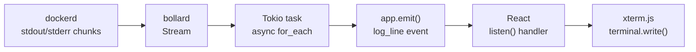

### 10.2 Stats Streaming

Container CPU, memory and network I/O stats are streamed from `GET /containers/{id}/stats?stream=true`. The Docker API returns one JSON object per second. The Rust backend deserialises each chunk and emits it as a Tauri event. React receives the event and updates the Recharts state.

### 10.3 Docker Event Stream

The global Docker event stream (`GET /events`) is subscribed to on app startup. It provides real-time notifications for container state changes (start, stop, die, pause) without polling.
```rust
// Used for:
// - Tray icon updates when daemon state changes
// - Dashboard badge refresh when containers start/stop
// - Crash notification when container 'die' event fires
```

---

## 11. Cross-Distro Compatibility

### 11.1 Socket Auto-Detection
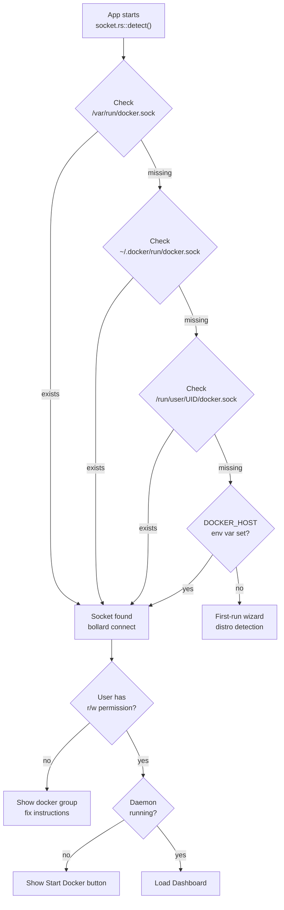

### 11.2 Distro Detection

When Docker is not found, the app reads `/etc/os-release` to show distro-specific install instructions.
```rust
// src-tauri/src/system/socket.rs

pub fn detect_distro() -> Option<String> {
    let content = std::fs::read_to_string("/etc/os-release").ok()?;
    for line in content.lines() {
        if line.starts_with("ID=") {
            return Some(line.replace("ID=", "").replace('"', "").to_lowercase());
        }
    }
    None
}

pub fn install_command(distro: &str) -> &'static str {
    match distro {
        "ubuntu" | "debian" | "linuxmint" | "pop" => "sudo apt install docker.io",
        "fedora" | "rhel" | "centos" => "sudo dnf install docker-ce",
        "arch" | "manjaro" | "endeavouros" => "sudo pacman -S docker",
        "opensuse-tumbleweed" | "opensuse-leap" => "sudo zypper install docker",
        _ => "https://docs.docker.com/engine/install/",
    }
}
```

### 11.3 Packaging Targets

| Format | Target | Built on | Command |
|---|---|---|---|
| `.AppImage` | Universal Linux (glibc 2.31+) | ubuntu-22.04 runner | `cargo tauri build` |
| `.deb` | Ubuntu · Debian · Mint · Pop!_OS | ubuntu-22.04 runner | `cargo tauri build` |
| `.rpm` | Fedora · RHEL · openSUSE | Fedora container | `cargo tauri build` |
| `PKGBUILD` (AUR) | Arch · Manjaro | Arch container | Manual |
| Flatpak | All distros (sandboxed) | ubuntu-22.04 runner | `flatpak-builder` |

---

## 12. Packaging & Distribution

### 12.1 Release Pipeline
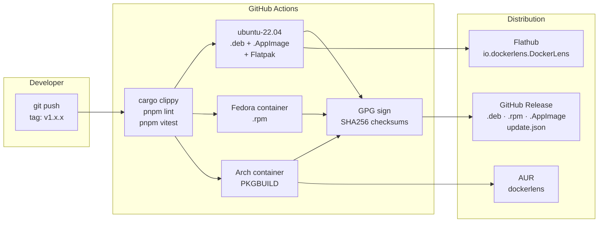

### 12.2 Auto-Updater

The Tauri updater plugin checks for new versions against a `latest.json` endpoint served from GitHub Releases. Users see an in-app update prompt. No auto-install without user confirmation.

---

## 13. CI/CD Pipeline
```yaml
# .github/workflows/build.yml — structure overview

name: Build & Release

on:
  push:
    tags: ['v*']
  pull_request:
    branches: [main]

jobs:
  lint-and-test:
    runs-on: ubuntu-22.04
    steps:
      - cargo clippy -- -D warnings
      - cargo test
      - pnpm install && pnpm lint && pnpm vitest

  build-ubuntu:
    runs-on: ubuntu-22.04
    needs: lint-and-test
    outputs: .deb, .AppImage, Flatpak

  build-fedora:
    runs-on: ubuntu-22.04        # uses Fedora Docker container
    needs: lint-and-test
    outputs: .rpm

  build-arch:
    runs-on: ubuntu-22.04        # uses Arch Docker container
    needs: lint-and-test
    outputs: PKGBUILD

  release:
    needs: [build-ubuntu, build-fedora, build-arch]
    steps:
      - Sign artifacts with GPG
      - Generate SHA256 checksums
      - Upload to GitHub Release
      - Publish update.json for Tauri updater
```

---

## 14. Security Considerations

| Area | Risk | Mitigation |
|---|---|---|
| Docker socket access | Full Docker API access if socket is readable | User must be in `docker` group — same as Docker CLI |
| Tauri IPC | Malicious JS calling privileged Rust commands | Tauri's allowlist restricts which commands are exposed |
| Daemon control (pkexec) | Privilege escalation abuse | Only `systemctl start/stop/restart/enable docker` — hardcoded, no user input passed |
| Supabase JWT | Token theft | Stored in `localStorage` — Tauri's WebView is sandboxed, no browser extensions |
| Supabase RLS | One user reading another's preferences | Row Level Security policy enforces `auth.uid() = id` |
| Auto-updater | Supply chain attack via update.json | Updates signed with GPG, checksums verified before install |
| Deep link hijacking | Another app registering `dockerlens://` | Tauri registers the scheme at OS level during install |
| No Docker data in cloud | Privacy | Enforced at architecture level — bollard talks only to local socket, supabase-js talks only to Supabase |

---

## 15. Development Setup

### 15.1 Prerequisites

| Tool | Version | Install |
|---|---|---|
| Rust | 1.75+ | `curl --proto '=https' --tlsv1.2 -sSf https://sh.rustup.rs \| sh` |
| Node.js | 20 LTS | via fnm: `curl -fsSL https://fnm.vercel.dev/install \| bash` |
| pnpm | 10.x | `curl -fsSL https://get.pnpm.io/install.sh \| sh -` |
| Tauri CLI | 2.x | `cargo install tauri-cli` |

### 15.2 Ubuntu System Dependencies
```bash
sudo apt install -y \
  libwebkit2gtk-4.1-dev \
  libgtk-3-dev \
  libayatana-appindicator3-dev \
  librsvg2-dev \
  libssl-dev \
  build-essential
```

### 15.3 Environment Variables
```bash
# .env — never commit this file
VITE_SUPABASE_URL=https://your-project.supabase.co
VITE_SUPABASE_ANON_KEY=your-anon-key
```

### 15.4 Run Locally
```bash
git clone https://github.com/yourusername/dockerlens.git
cd dockerlens
pnpm install
pnpm tauri dev          # starts Vite + Rust, opens native window
```

### 15.5 Build for Production
```bash
pnpm tauri build
# Output: src-tauri/target/release/bundle/
# → deb/  rpm/  appimage/
```

### 15.6 Useful Commands
```bash
cargo clippy            # Rust linter — must pass before PRs
cargo test              # Rust unit tests
pnpm lint               # ESLint
pnpm vitest             # Frontend unit tests
pnpm tauri dev          # Development mode
pnpm tauri build        # Production build
```

---

## 16. Dependency Reference

### 16.1 Rust Crates (`src-tauri/Cargo.toml`)

| Crate | Version | Purpose |
|---|---|---|
| `tauri` | `2` | Core framework |
| `tauri-build` | `2` | Build script |
| `bollard` | `0.17` | Docker Engine API client |
| `tokio` | `1` | Async runtime (`full` features) |
| `serde` | `1` | Serialisation / deserialisation |
| `serde_json` | `1` | JSON serialisation |
| `serde_yaml` | `0.9` | Docker Compose YAML parsing |
| `anyhow` | `1` | Error handling |
| `thiserror` | `1` | Custom error types |
| `futures` | `0.3` | Async stream utilities |
| `log` | `0.4` | Logging facade |
| `env_logger` | `0.11` | Log output to stderr |
| `dirs` | `5` | Cross-distro home directory paths |
| `which` | `6` | Detect if `docker` binary is on PATH |
| `tauri-plugin-shell` | `2` | Spawn shell commands |
| `tauri-plugin-notification` | `2` | Desktop notifications |
| `tauri-plugin-system-tray` | `2` | System tray icon + menu |
| `tauri-plugin-updater` | `2` | In-app auto-update |
| `tauri-plugin-deep-link` | `2` | URI scheme for OAuth callback |
| `tauri-plugin-dialog` | `2` | Native file picker (Compose) |

### 16.2 Node Packages (`package.json`)

| Package | Version | Purpose |
|---|---|---|
| `react` | `18` | UI framework |
| `react-dom` | `18` | React DOM renderer |
| `typescript` | `5` | TypeScript compiler |
| `vite` | `5` | Bundler |
| `@tauri-apps/api` | `2` | Tauri JS APIs (`invoke`, `listen`) |
| `@tauri-apps/plugin-deep-link` | `2` | Deep link JS handler |
| `@supabase/supabase-js` | `2` | Supabase auth + Postgres client |
| `zustand` | `4` | Global state management |
| `@tanstack/react-query` | `5` | Server state, data fetching |
| `recharts` | `2` | CPU / RAM / network graphs |
| `xterm` | `5` | Terminal emulator |
| `xterm-addon-fit` | `0.8` | xterm.js auto-resize |
| `xterm-addon-web-links` | `0.9` | Clickable links in terminal |
| `tailwindcss` | `3` | Utility CSS |
| `@shadcn/ui` | `latest` | Accessible components |
| `lucide-react` | `latest` | Icon set |
| `date-fns` | `3` | Date formatting for logs |
| `js-yaml` | `4` | Compose file YAML parsing (UI) |

---

## 17. Glossary

| Term | Definition |
|---|---|
| **bollard** | The Rust crate used to communicate with Docker Engine via the REST API over a Unix socket. All Docker operations in DockerLens go through bollard. |
| **Tauri** | The Rust framework that wraps the React UI in a native OS window. Provides IPC, system tray, notifications, file dialogs and OS integration. |
| **IPC** | Inter-Process Communication. In Tauri, the mechanism by which React calls Rust functions (`invoke`) and Rust pushes events to React (`emit`). |
| **invoke()** | The Tauri JS function that calls a `#[tauri::command]` Rust function. Returns a Promise. |
| **emit()** | The Tauri Rust function that fires a named event to the React frontend. Received by `listen()` in React. |
| **bollard stream** | An async Rust iterator that yields Docker API responses chunk by chunk — used for live logs, stats and event streams. |
| **Tokio** | The async runtime that powers the Rust backend. Enables non-blocking I/O so log streaming and API calls happen concurrently. |
| **Unix socket** | The file at `/var/run/docker.sock` through which DockerLens communicates with Docker Engine using HTTP requests. |
| **Rootless Docker** | A Docker configuration where the daemon runs as a non-root user. Uses `~/.docker/run/docker.sock`. No sudo needed for daemon control. |
| **Polkit / pkexec** | Linux privilege escalation. `pkexec systemctl start docker` shows a native OS password dialog — no terminal required. |
| **Supabase** | Open-source Firebase alternative. Provides hosted Postgres + Auth for DockerLens optional settings sync. |
| **supabase-js** | The official JavaScript client for Supabase. Manages the OAuth session on the React side. |
| **PKCE** | Proof Key for Code Exchange. The OAuth flow type required for desktop apps (non-web). Used in the Supabase auth configuration. |
| **Deep link** | A custom URI scheme (`dockerlens://`) registered with the OS. Used to redirect the browser back to the Tauri app after OAuth. |
| **Zustand** | Lightweight React state management library. Used for client-side state (screen, daemon status, auth session). |
| **TanStack Query** | React data fetching library. Used for Docker API data — handles caching, background refetching and loading states. |
| **xterm.js** | A terminal emulator library for the browser/WebView. Used for the exec shell session and log streaming. |
| **AppImage** | Universal Linux binary format. Runs on any distro with glibc 2.31+ — no installation required. |
| **PRD** | Product Requirements Document. Defines what to build and why. Located at `docs/requirements/PRD.md`. |
| **TRD** | Technical Requirements Document. This file. Defines how to build it. |
