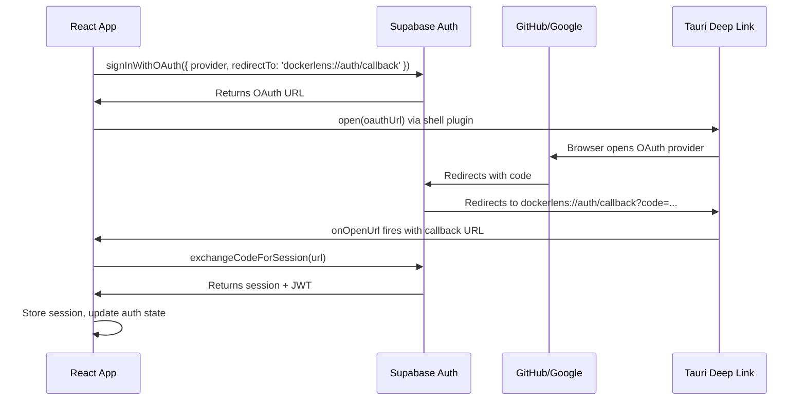

# Supabase — Best Practices

> **Applies to:** Supabase project dashboard · database schema · future `src/lib/supabase.ts` (file does not exist in the scaffold yet — add when optional auth/settings sync ships).
> **Version:** supabase-js v2 · PostgreSQL 15+
> **Last reviewed:** March 2026
> **References:** Supabase Production Checklist · Supabase RLS Docs · Supabase Security Guide

---

## Table of Contents

1. [Authentication Setup](#1-authentication-setup)
2. [Row Level Security](#2-row-level-security)
3. [Key Management](#3-key-management)
4. [Client Initialisation](#4-client-initialisation)
5. [PKCE Flow for Desktop Apps](#5-pkce-flow-for-desktop-apps)
6. [Database Schema Security](#6-database-schema-security)
7. [Session Management](#7-session-management)
8. [Rate Limiting & Abuse Prevention](#8-rate-limiting--abuse-prevention)
9. [Production Checklist](#9-production-checklist)

---

## 1. Authentication Setup

### Configure OAuth providers in Supabase Dashboard

1. **Authentication → Providers → GitHub**
   - Enable GitHub OAuth
   - Add GitHub OAuth App credentials
   - Set redirect URL: `https://your-project.supabase.co/auth/v1/callback`

2. **Authentication → Providers → Google**
   - Enable Google OAuth
   - Add Google OAuth credentials
   - Set redirect URL: `https://your-project.supabase.co/auth/v1/callback`

### Callback URL for Tauri deep link

In both GitHub and Google OAuth apps, add the Supabase callback URL — **not** the `dockerlens://` deep link. Supabase handles the OAuth exchange, then redirects to your deep link:
```
Redirect URI in GitHub/Google: https://your-project.supabase.co/auth/v1/callback
```

Supabase then redirects to `dockerlens://auth/callback` as configured in your Supabase project under **Authentication → URL Configuration → Redirect URLs**.

Add the deep link URL to the allowlist:
```
dockerlens://auth/callback
```

### Set token expiry

In **Authentication → Settings**:

| Setting | Recommended value |
|---|---|
| JWT expiry | `3600` (1 hour) |
| Refresh token rotation | Enabled |
| Reuse interval | `10` seconds |

---

## 2. Row Level Security

**RLS must be enabled on every table in the `public` schema. No exceptions.**

### Enable RLS on `user_preferences`
```sql
-- Enable RLS
ALTER TABLE user_preferences ENABLE ROW LEVEL SECURITY;

-- ✅ Users can only read their own preferences
CREATE POLICY "users_read_own_preferences"
ON user_preferences
FOR SELECT
TO authenticated
USING (auth.uid() = id);

-- ✅ Users can only insert their own row
CREATE POLICY "users_insert_own_preferences"
ON user_preferences
FOR INSERT
TO authenticated
WITH CHECK (auth.uid() = id);

-- ✅ Users can only update their own row
CREATE POLICY "users_update_own_preferences"
ON user_preferences
FOR UPDATE
TO authenticated
USING (auth.uid() = id)
WITH CHECK (auth.uid() = id);

-- ✅ Users can only delete their own row
CREATE POLICY "users_delete_own_preferences"
ON user_preferences
FOR DELETE
TO authenticated
USING (auth.uid() = id);
```

### Performance: wrap `auth.uid()` in a subquery

For tables with many rows, calling `auth.uid()` inline creates performance issues because it's evaluated per row. Wrap it:
```sql
-- ❌ Slower — auth.uid() evaluated per row
USING (id = auth.uid())

-- ✅ Faster — subquery evaluated once per query
USING (id = (SELECT auth.uid()))
```

### Always specify the `TO` clause
```sql
-- ❌ Policy applies to all roles — includes anon, which you don't want
CREATE POLICY "read_own" ON user_preferences FOR SELECT
USING (auth.uid() = id);

-- ✅ Explicit — only authenticated users
CREATE POLICY "read_own" ON user_preferences FOR SELECT
TO authenticated
USING ((SELECT auth.uid()) = id);
```

### Never rely on `user_metadata` in RLS policies

`user_metadata` can be modified by the authenticated user — use it for display purposes only, never for authorization.
```sql
-- ❌ Insecure — user can modify their own metadata
USING (auth.jwt() -> 'user_metadata' ->> 'role' = 'admin')

-- ✅ Secure — app_metadata can only be set server-side
USING (auth.jwt() -> 'app_metadata' ->> 'role' = 'admin')
```

### Test RLS policies before deploying

Use the Supabase Dashboard's **RLS Policy Tester** (Authentication → Policies → Test) to verify your policies work as expected for each role before pushing to production.

---

## 3. Key Management

### Three keys — each with a different purpose

| Key | Where used | Can bypass RLS? | Exposure |
|---|---|---|---|
| `anon` | React frontend (public) | No — subject to RLS | Safe to expose in client |
| `service_role` | Server-side / CI only | **Yes — bypasses all RLS** | **NEVER in frontend** |
| `JWT secret` | Never in app code | N/A | Supabase internal only |

### Rules
```typescript
// ✅ Only anon key in frontend
const supabase = createClient(
    import.meta.env.VITE_SUPABASE_URL,
    import.meta.env.VITE_SUPABASE_ANON_KEY
);

// ❌ NEVER — service role bypasses RLS, exposes all user data
const supabase = createClient(
    import.meta.env.VITE_SUPABASE_URL,
    import.meta.env.VITE_SUPABASE_SERVICE_ROLE_KEY // NEVER IN FRONTEND
);
```

### Environment variables
```bash
# .env — development only — NEVER commit
VITE_SUPABASE_URL=https://your-project.supabase.co
VITE_SUPABASE_ANON_KEY=eyJhbGciOiJIUzI1NiIsInR5cCI6IkpXVCJ9...

# .gitignore must include:
.env
.env.local
.env.*.local
```

---

## 4. Client Initialisation

### Desktop app configuration — PKCE is required
```typescript
// src/lib/supabase.ts
import { createClient } from '@supabase/supabase-js';

const SUPABASE_URL = import.meta.env.VITE_SUPABASE_URL;
const SUPABASE_ANON_KEY = import.meta.env.VITE_SUPABASE_ANON_KEY;

if (!SUPABASE_URL || !SUPABASE_ANON_KEY) {
    throw new Error('Missing Supabase environment variables');
}

export const supabase = createClient(SUPABASE_URL, SUPABASE_ANON_KEY, {
    auth: {
        flowType: 'pkce',          // Required for desktop apps — not implicit
        detectSessionInUrl: true,  // Detects auth callback from deep link
        persistSession: true,      // Store session in localStorage
        autoRefreshToken: true,    // Refresh before expiry automatically
        storage: window.localStorage,
    },
});
```

### Why PKCE is required for desktop apps

Implicit flow (`flowType: 'implicit'`) puts the access token in the URL fragment. In a desktop app, this could be intercepted by malicious processes monitoring URL schemes. PKCE (Proof Key for Code Exchange) exchanges a code verifier/challenge instead — much safer.

---

## 5. PKCE Flow for Desktop Apps


### Implementation
```typescript
// Initiate OAuth
const signInWithGitHub = async () => {
    const { error } = await supabase.auth.signInWithOAuth({
        provider: 'github',
        options: {
            redirectTo: 'dockerlens://auth/callback',
            scopes: 'read:user user:email',  // minimum required scopes
        },
    });
    if (error) throw error;
};

// Handle deep link callback (called from Tauri onOpenUrl handler)
export const handleAuthCallback = async (url: string) => {
    const { data, error } = await supabase.auth.exchangeCodeForSession(url);
    if (error) throw error;
    return data.session;
};
```

---

## 6. Database Schema Security

### Schema for `user_preferences`
```sql
CREATE TABLE user_preferences (
    -- Use auth.users ID as primary key — auto-links to the user
    id              UUID PRIMARY KEY REFERENCES auth.users(id) ON DELETE CASCADE,

    -- Preferences
    theme           TEXT NOT NULL DEFAULT 'dark'
                    CHECK (theme IN ('dark', 'light', 'system')),
    socket_path     TEXT NOT NULL DEFAULT '',
    notifs_on       BOOLEAN NOT NULL DEFAULT true,
    start_on_login  BOOLEAN NOT NULL DEFAULT true,
    dismissed_suggestions TEXT[] NOT NULL DEFAULT '{}',

    -- Timestamps
    created_at      TIMESTAMPTZ NOT NULL DEFAULT now(),
    updated_at      TIMESTAMPTZ NOT NULL DEFAULT now()
);

-- Auto-update updated_at on row change
CREATE OR REPLACE FUNCTION update_updated_at()
RETURNS TRIGGER AS $$
BEGIN
    NEW.updated_at = now();
    RETURN NEW;
END;
$$ LANGUAGE plpgsql;

CREATE TRIGGER update_preferences_updated_at
BEFORE UPDATE ON user_preferences
FOR EACH ROW EXECUTE FUNCTION update_updated_at();
```

### Auto-create preferences row on signup
```sql
-- Automatically create preferences when a user signs up
CREATE OR REPLACE FUNCTION create_user_preferences()
RETURNS TRIGGER AS $$
BEGIN
    INSERT INTO public.user_preferences (id)
    VALUES (NEW.id)
    ON CONFLICT (id) DO NOTHING;
    RETURN NEW;
END;
$$ LANGUAGE plpgsql SECURITY DEFINER;

CREATE TRIGGER on_auth_user_created
AFTER INSERT ON auth.users
FOR EACH ROW EXECUTE FUNCTION create_user_preferences();
```

### Input validation with CHECK constraints
```sql
-- ✅ Enforce valid values at the database level — not just application level
ALTER TABLE user_preferences
    ADD CONSTRAINT valid_theme
    CHECK (theme IN ('dark', 'light', 'system'));

ALTER TABLE user_preferences
    ADD CONSTRAINT valid_socket_path
    CHECK (length(socket_path) <= 512);
```

---

## 7. Session Management

### Always use `getUser()` for server-side trust decisions
```typescript
// ❌ getSession() reads from local storage — can be tampered with
const { data: { session } } = await supabase.auth.getSession();
const userId = session?.user?.id; // don't trust this for security decisions

// ✅ getUser() verifies with Supabase server — always fresh
const { data: { user }, error } = await supabase.auth.getUser();
if (error || !user) {
    // Not authenticated
    return;
}
const userId = user.id; // verified server-side
```

### Listen for auth state changes
```typescript
// src/store/auth.store.ts
useEffect(() => {
    const { data: { subscription } } = supabase.auth.onAuthStateChange(
        async (event, session) => {
            switch (event) {
                case 'SIGNED_IN':
                    setUser(session?.user ?? null);
                    await loadUserPreferences(session?.user?.id);
                    break;
                case 'SIGNED_OUT':
                    setUser(null);
                    clearUserPreferences();
                    break;
                case 'TOKEN_REFRESHED':
                    // Session refreshed automatically — no action needed
                    break;
                case 'USER_UPDATED':
                    setUser(session?.user ?? null);
                    break;
            }
        }
    );

    return () => subscription.unsubscribe();
}, []);
```

### Sign out properly — clear all local state
```typescript
const signOut = async () => {
    await supabase.auth.signOut();
    // Clear all local app state
    useAuthStore.getState().clear();
    useAppStore.getState().setScreen('dashboard');
};
```

---

## 8. Rate Limiting & Abuse Prevention

### Default auth rate limits (Supabase hosted)

| Endpoint | Default limit |
|---|---|
| `/auth/v1/signup` | 30 requests / hour |
| `/auth/v1/token` | 30 requests / 5 minutes |
| `/auth/v1/recover` | 3 requests / hour |
| `/auth/v1/otp` | 30 requests / hour |

For DockerLens (desktop app), these limits are extremely generous — a single user will rarely hit them.

### Handle rate limit errors gracefully
```typescript
const signIn = async (provider: 'github' | 'google') => {
    try {
        const { error } = await supabase.auth.signInWithOAuth({ provider });
        if (error) {
            if (error.status === 429) {
                toast.error('Too many sign-in attempts. Please wait a moment.');
            } else {
                toast.error(`Sign-in failed: ${error.message}`);
            }
        }
    } catch (e) {
        toast.error('Network error — check your connection');
    }
};
```

---

## 9. Production Checklist

From the official Supabase Production Checklist (`supabase.com/docs/guides/deployment/going-into-prod`):

### Security

- [ ] RLS enabled on all tables in `public` schema
- [ ] All policies use `TO authenticated` clause
- [ ] No `service_role` key in frontend code
- [ ] `anon` key stored only in environment variables
- [ ] SSL enforcement enabled in Dashboard → Database → Settings
- [ ] Network restrictions configured in Dashboard → Database → Settings
- [ ] Supabase account protected with MFA

### Authentication

- [ ] OAuth redirect URLs configured in Supabase Dashboard
- [ ] `dockerlens://auth/callback` added to allowed redirect URLs
- [ ] JWT expiry set to 3600 seconds or lower
- [ ] Refresh token rotation enabled
- [ ] PKCE flow configured (`flowType: 'pkce'`)

### Database

- [ ] `user_preferences` table has CHECK constraints for valid values
- [ ] Auto-create trigger for new users is working
- [ ] `updated_at` trigger is working
- [ ] Indexes on `id` column (primary key — automatic)

### Client

- [ ] `VITE_SUPABASE_URL` and `VITE_SUPABASE_ANON_KEY` in `.env` (not committed)
- [ ] `.env` in `.gitignore`
- [ ] Auth state change listener set up in root component
- [ ] Sign-out clears all local state
- [ ] `getUser()` used (not `getSession()`) for security decisions