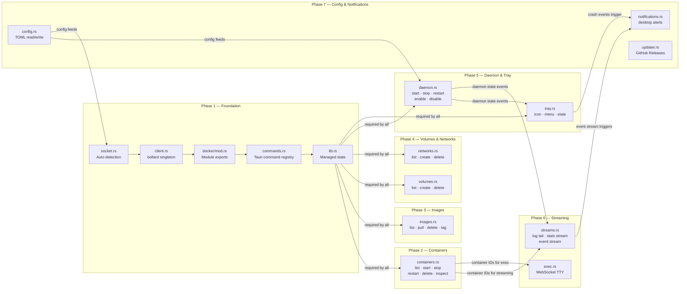
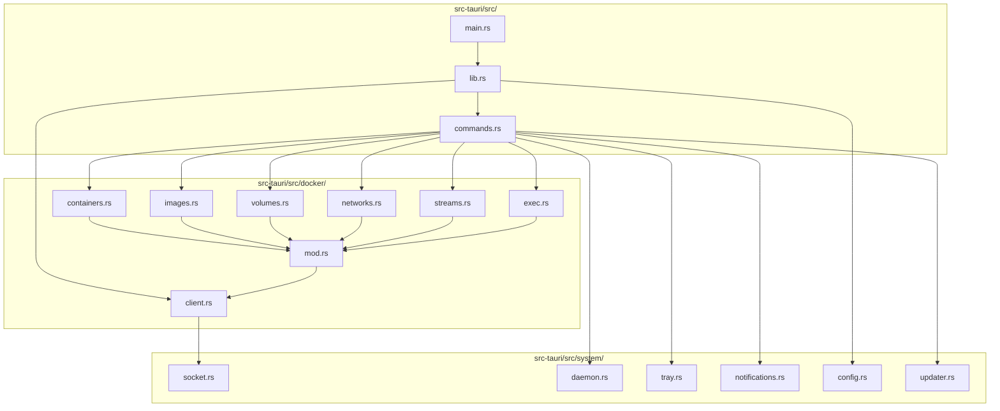

# DockerLens — Implementation Plan

> **Branch convention:** Each phase gets its own feature branch.
> **Merge policy:** Phase N must be merged and `pnpm tauri dev` confirmed working before Phase N+1 begins.
> **Scope:** This folder covers backend (Rust) only. Frontend plan lives in `docs/plan/frontend/`.

---

## Table of Contents

- [Backend Phases](#backend-phases)
- [Full Phase Dependency Map](#full-phase-dependency-map)
- [File Ownership Map](#file-ownership-map)
- [Branch Strategy](#branch-strategy)
- [Definition of Done](#definition-of-done)

---

## Backend Phases

| Phase | Name | Branch | Unlocks |
|---|---|---|---|
| **P1** | Foundation — Socket + Client | `feat/docker-client-foundation` | Everything |
| **P2** | Container Management | `feat/backend-containers` | P3, P4, P6 |
| **P3** | Image Management | `feat/backend-images` | None (parallel with P4) |
| **P4** | Volumes & Networks | `feat/backend-volumes-networks` | None (parallel with P3) |
| **P5** | Daemon Control & System Tray | `feat/backend-daemon-tray` | None (parallel with P3/P4) |
| **P6** | Real-Time Streaming | `feat/backend-streaming` | Frontend logs + stats UI |
| **P7** | Config, Notifications & Updater | `feat/backend-config-notifications` | Settings sync, onboarding |

---

## Full Phase Dependency Map


---

## File Ownership Map


---

## Branch Strategy
```
main
├── feat/docker-client-foundation   ← Phase 1
├── feat/backend-containers         ← Phase 2 (branches from P1 merge)
├── feat/backend-images             ← Phase 3 (branches from P1 merge)
├── feat/backend-volumes-networks   ← Phase 4 (branches from P1 merge)
├── feat/backend-daemon-tray        ← Phase 5 (branches from P1 merge)
├── feat/backend-streaming          ← Phase 6 (branches from P2 merge)
└── feat/backend-config-notifications ← Phase 7 (branches from P5 merge)
```

Phases 2, 3, 4 and 5 can all be worked on in parallel after Phase 1 merges.
Phase 6 requires Phase 2 to be merged first — it needs real container IDs.
Phase 7 requires Phase 5 to be merged first — it needs daemon state.

---

## Definition of Done

A phase is **done** when all of the following are true:

- [ ] All files listed in the phase are implemented — no empty stubs
- [ ] `cargo clippy -- -D warnings` passes with zero warnings
- [ ] `cargo test` passes — all unit tests for the phase pass
- [ ] `cargo audit` passes — no new vulnerabilities
- [ ] `pnpm tauri dev` opens with no Rust compile errors
- [ ] A smoke test confirms the feature works against a real Docker socket
- [ ] PR opened with the phase checklist completed
- [ ] Merged to `main` before next phase begins