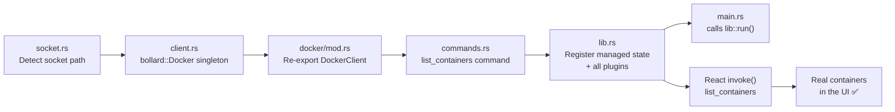
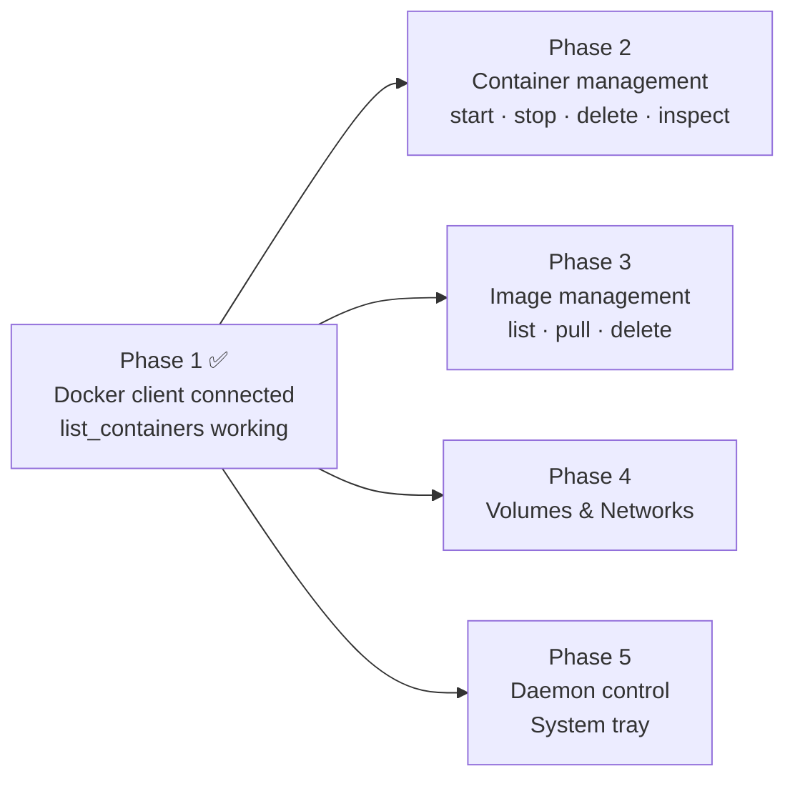

# Phase 1 — Foundation

> **Branch:** `feat/docker-client-foundation`
> **Depends on:** Nothing — this is the root of the entire backend
> **Unlocks:** Every other phase
> **Estimated effort:** 2–3 days

---

## Objective

Establish the Rust backend foundation that every other phase builds on. By the end of this phase, the app connects to `/var/run/docker.sock`, lists real containers from the user's Docker Engine via a typed `invoke()` call from React, and displays them in the UI.

This is the most important phase. Get it right before touching anything else.

---

## File Map


---

## Implementation

### 1. `src-tauri/src/system/socket.rs`

**Responsibility:** Detect the correct Docker socket path on any Linux distro. Returns the first accessible path. Never panics — returns `None` if nothing is found so the onboarding wizard can take over.

**DRY principle:** This is the single source of truth for socket detection. No other module ever hardcodes `/var/run/docker.sock`. Every module that needs the socket path calls `detect()`.
```rust
use std::path::{Path, PathBuf};
use std::env;

/// All socket paths to try, in priority order.
/// Single source of truth — never hardcode socket paths elsewhere.
const SOCKET_CANDIDATES: &[&str] = &[
    "/var/run/docker.sock",           // root Docker — most common
    ".docker/run/docker.sock",        // rootless Docker (relative to $HOME)
    "/run/docker.sock",               // some distros
];

/// Detects the Docker socket path on the current system.
///
/// Checks candidates in order:
/// 1. Standard root Docker socket
/// 2. Rootless Docker socket (relative to $HOME)
/// 3. Alternate socket paths
/// 4. DOCKER_HOST environment variable
///
/// Returns `None` if no accessible socket is found.
/// The onboarding wizard handles the `None` case.
pub fn detect() -> Option<String> {
    // Check DOCKER_HOST first — explicit user override wins
    if let Ok(host) = env::var("DOCKER_HOST") {
        let path = host.replace("unix://", "");
        if Path::new(&path).exists() {
            log::info!("Docker socket found via DOCKER_HOST: {}", path);
            return Some(path);
        }
    }

    let home = env::var("HOME").unwrap_or_default();

    for candidate in SOCKET_CANDIDATES {
        let path = if candidate.starts_with('/') {
            PathBuf::from(candidate)
        } else {
            PathBuf::from(&home).join(candidate)
        };

        if path.exists() {
            let path_str = path.to_string_lossy().to_string();
            log::info!("Docker socket found: {}", path_str);
            return Some(path_str);
        }
    }

    log::warn!("No Docker socket found — onboarding wizard will be shown");
    None
}

/// Returns the active socket path or a sensible default for display purposes.
/// Use `detect()` for actual connection — use this only for UI display.
pub fn display_path() -> String {
    detect().unwrap_or_else(|| "/var/run/docker.sock".to_string())
}

#[cfg(test)]
mod tests {
    use super::*;

    #[test]
    fn test_display_path_never_panics() {
        // Should always return a string — never panic
        let path = display_path();
        assert!(!path.is_empty());
    }

    #[test]
    fn test_socket_candidates_not_empty() {
        assert!(!SOCKET_CANDIDATES.is_empty());
    }
}
```

---

### 2. `src-tauri/src/docker/client.rs`

**Responsibility:** Owns the bollard `Docker` client. Created once at app startup, stored in Tauri managed state, shared across all command handlers via `State<'_, DockerState>`.

**DRY principle:** One client, one connection. No command handler ever creates its own `Docker` instance.
```rust
use bollard::Docker;
use thiserror::Error;

#[derive(Error, Debug)]
pub enum ClientError {
    #[error("Docker socket not found. Is Docker Engine installed?")]
    SocketNotFound,

    #[error("Failed to connect to Docker: {0}")]
    ConnectionFailed(#[from] bollard::errors::Error),
}

/// Holds the active bollard Docker client.
/// Stored as Tauri managed state — shared across all command handlers.
pub struct DockerClient {
    pub inner: Docker,
    pub socket_path: String,
}

impl DockerClient {
    /// Connects to Docker using auto-detected socket path.
    /// Called once at app startup in lib.rs.
    pub fn connect() -> Result<Self, ClientError> {
        let socket_path = crate::system::socket::detect()
            .ok_or(ClientError::SocketNotFound)?;

        let client = Docker::connect_with_unix(
            &socket_path,
            120,
            bollard::API_DEFAULT_VERSION,
        )?;

        log::info!("bollard connected to {}", socket_path);

        Ok(Self { inner: client, socket_path })
    }

    /// Connects to a specific socket path.
    /// Used for custom paths from settings or DOCKER_HOST.
    pub fn connect_to(socket_path: &str) -> Result<Self, ClientError> {
        let client = Docker::connect_with_unix(
            socket_path,
            120,
            bollard::API_DEFAULT_VERSION,
        )?;

        log::info!("bollard connected to custom path: {}", socket_path);

        Ok(Self {
            inner: client,
            socket_path: socket_path.to_string(),
        })
    }
}
```

---

### 3. `src-tauri/src/docker/mod.rs`

**Responsibility:** Module-level re-exports only. No logic here.
```rust
pub mod client;
pub mod containers;
pub mod images;
pub mod volumes;
pub mod networks;
pub mod streams;
pub mod exec;

// Re-export the client type so other modules use a clean path
pub use client::DockerClient;
```

---

### 4. `src-tauri/src/docker/containers.rs` (Phase 1 — list only)

**Responsibility:** Phase 1 implements `list_containers` only. Start/stop/delete/inspect are implemented in Phase 2.
```rust
use bollard::container::ListContainersOptions;
use serde::{Deserialize, Serialize};
use std::collections::HashMap;
use tauri::State;
use crate::docker::DockerClient;

/// Serialisable container summary returned to the React frontend.
/// Maps directly to bollard's ContainerSummary — only fields the UI needs.
/// DRY: single source of truth for container data shape between Rust and TypeScript.
#[derive(Debug, Serialize, Deserialize)]
pub struct ContainerSummary {
    pub id: String,
    pub name: String,
    pub image: String,
    pub status: String,
    pub state: String,
    pub created: i64,
    pub ports: Vec<PortBinding>,
    pub labels: HashMap<String, String>,
}

#[derive(Debug, Serialize, Deserialize)]
pub struct PortBinding {
    pub host_ip: Option<String>,
    pub host_port: Option<String>,
    pub container_port: u16,
    pub protocol: String,
}

/// Lists all containers including stopped and paused ones.
///
/// # Errors
/// Returns an error string if the Docker socket is not accessible.
/// Tauri serialises this as a JS Promise rejection.
#[tauri::command]
pub async fn list_containers(
    client: State<'_, DockerClient>,
) -> Result<Vec<ContainerSummary>, String> {
    let opts = ListContainersOptions::<String> {
        all: true,
        ..Default::default()
    };

    let containers = client
        .inner
        .list_containers(Some(opts))
        .await
        .map_err(|e| format!("Failed to list containers: {e}"))?;

    let result = containers
        .into_iter()
        .filter_map(|c| {
            let id = c.id?;
            let name = c.names?
                .into_iter()
                .next()?
                .trim_start_matches('/')
                .to_string();
            let image = c.image.unwrap_or_default();
            let status = c.status.unwrap_or_default();
            let state = c.state.unwrap_or_default();
            let created = c.created.unwrap_or(0);
            let labels = c.labels.unwrap_or_default();

            let ports = c.ports.unwrap_or_default()
                .into_iter()
                .filter_map(|p| {
                    Some(PortBinding {
                        host_ip: p.ip,
                        host_port: p.public_port.map(|v| v.to_string()),
                        container_port: p.private_port,
                        protocol: p.typ
                            .map(|t| format!("{:?}", t).to_lowercase())
                            .unwrap_or_else(|| "tcp".into()),
                    })
                })
                .collect();

            Some(ContainerSummary { id, name, image, status, state, created, ports, labels })
        })
        .collect();

    Ok(result)
}
```

---

### 5. `src-tauri/src/commands.rs`

**Responsibility:** Single registration point for all `#[tauri::command]` functions. Nothing else. Keeps `lib.rs` clean.
```rust
// Phase 1
pub use crate::docker::containers::list_containers;

// Phase 2 — uncomment when implemented
// pub use crate::docker::containers::{
//     start_container, stop_container, restart_container,
//     delete_container, inspect_container,
// };

// Phase 3
// pub use crate::docker::images::{
//     list_images, pull_image, delete_image,
// };

// Phase 4
// pub use crate::docker::volumes::{list_volumes, create_volume, delete_volume};
// pub use crate::docker::networks::{list_networks, create_network, delete_network};

// Phase 5
// pub use crate::system::daemon::{
//     start_docker_daemon, stop_docker_daemon,
//     restart_docker_daemon, enable_docker_daemon, disable_docker_daemon,
//     get_daemon_status,
// };

// Phase 6
// pub use crate::docker::streams::{subscribe_logs, subscribe_stats};
// pub use crate::docker::exec::{exec_create, exec_resize};

// Phase 7
// pub use crate::system::config::{get_config, update_config};
// pub use crate::system::updater::check_for_updates;
```

---

### 6. `src-tauri/src/lib.rs`

**Responsibility:** Tauri app bootstrap — managed state, plugin registration, command handler registration. One function: `run()`.
```rust
use tauri::Manager;

pub fn run() {
    env_logger::init();

    tauri::Builder::default()
        // ── Plugins ──────────────────────────────────────────────────────────
        .plugin(tauri_plugin_shell::init())
        .plugin(tauri_plugin_notification::init())
        .plugin(tauri_plugin_dialog::init())
        .plugin(tauri_plugin_process::init())
        .plugin(tauri_plugin_deep_link::init())
        .plugin(tauri_plugin_updater::Builder::new().build())
        // ── Managed state ────────────────────────────────────────────────────
        .setup(|app| {
            match crate::docker::DockerClient::connect() {
                Ok(client) => {
                    log::info!("Docker connected at {}", client.socket_path);
                    app.manage(client);
                }
                Err(e) => {
                    // Don't crash — let the UI show the onboarding wizard
                    log::warn!("Docker not available at startup: {}", e);
                }
            }
            Ok(())
        })
        // ── Commands ─────────────────────────────────────────────────────────
        .invoke_handler(tauri::generate_handler![
            crate::commands::list_containers,
        ])
        .run(tauri::generate_context!())
        .expect("DockerLens failed to start");
}
```

---

## Acceptance Criteria
```
✅ cargo clippy -- -D warnings    → zero warnings
✅ cargo test                      → all tests pass
✅ pnpm tauri dev                  → no Rust compile errors
✅ invoke("list_containers")       → returns real containers from /var/run/docker.sock
✅ Stopped Docker + launch         → app opens without crash (graceful degradation)
✅ No hardcoded socket paths       → all paths go through socket::detect()
```

---

## What This Phase Unlocks
