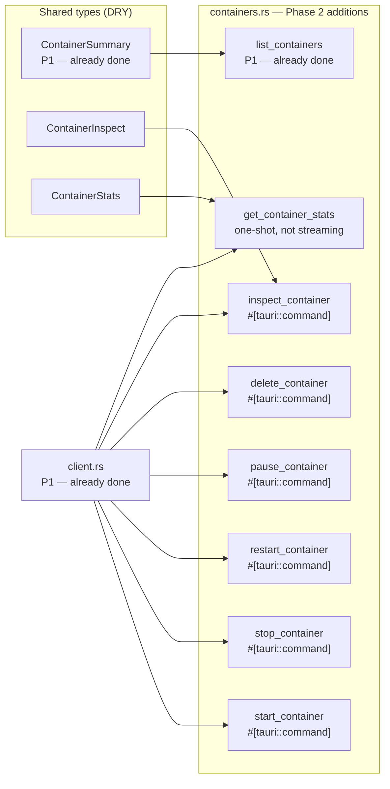

# Phase 2 — Container Management

> **Branch:** `feat/backend-containers`
> **Depends on:** Phase 1 merged to `main`
> **Unlocks:** Phase 6 (streaming needs container IDs)
> **Estimated effort:** 2–3 days

---

## Objective

Implement the full container lifecycle — start, stop, restart, pause, delete, inspect. Also implements `get_container_stats` (one-shot, not streaming — streaming is Phase 6).

By end of this phase, every button in the Containers UI calls a real Rust command against Docker.

---

## File Map


---

## DRY Principles for This Phase

All container commands share the same client instance via Tauri's managed state. Input validation is extracted to a shared helper — never duplicated per command.
```rust
/// Shared input validation for all container ID parameters.
/// DRY — called by every command that takes a container ID.
/// Returns Err(String) which Tauri serialises as a JS rejection.
fn validate_container_id(id: &str) -> Result<(), String> {
    if id.is_empty() {
        return Err("Container ID cannot be empty".to_string());
    }
    if id.len() > 128 {
        return Err("Container ID exceeds maximum length".to_string());
    }
    if !id.chars().all(|c| c.is_alphanumeric() || c == '-' || c == '_') {
        return Err("Container ID contains invalid characters".to_string());
    }
    Ok(())
}
```

---

## Implementation Additions to `containers.rs`
```rust
/// Starts a stopped or created container.
#[tauri::command]
pub async fn start_container(
    id: String,
    client: State<'_, DockerClient>,
) -> Result<(), String> {
    validate_container_id(&id)?;
    client.inner
        .start_container::<String>(&id, None)
        .await
        .map_err(|e| format!("Failed to start container {id}: {e}"))
}

/// Stops a running container gracefully.
/// `timeout_secs`: seconds to wait before SIGKILL. Default: 10.
#[tauri::command]
pub async fn stop_container(
    id: String,
    timeout_secs: Option<i64>,
    client: State<'_, DockerClient>,
) -> Result<(), String> {
    validate_container_id(&id)?;
    use bollard::container::StopContainerOptions;
    let opts = StopContainerOptions { t: timeout_secs.unwrap_or(10) };
    client.inner
        .stop_container(&id, Some(opts))
        .await
        .map_err(|e| format!("Failed to stop container {id}: {e}"))
}

/// Restarts a container.
#[tauri::command]
pub async fn restart_container(
    id: String,
    timeout_secs: Option<i64>,
    client: State<'_, DockerClient>,
) -> Result<(), String> {
    validate_container_id(&id)?;
    use bollard::container::RestartContainerOptions;
    let opts = RestartContainerOptions { t: timeout_secs.unwrap_or(10) as isize };
    client.inner
        .restart_container(&id, Some(opts))
        .await
        .map_err(|e| format!("Failed to restart container {id}: {e}"))
}

/// Pauses a running container (freezes all processes).
#[tauri::command]
pub async fn pause_container(
    id: String,
    client: State<'_, DockerClient>,
) -> Result<(), String> {
    validate_container_id(&id)?;
    client.inner
        .pause_container(&id)
        .await
        .map_err(|e| format!("Failed to pause container {id}: {e}"))
}

/// Removes a container.
/// `force`: if true, kills running containers before removing.
/// `remove_volumes`: if true, also removes anonymous volumes.
#[tauri::command]
pub async fn delete_container(
    id: String,
    force: Option<bool>,
    remove_volumes: Option<bool>,
    client: State<'_, DockerClient>,
) -> Result<(), String> {
    validate_container_id(&id)?;
    use bollard::container::RemoveContainerOptions;
    let opts = RemoveContainerOptions {
        force: force.unwrap_or(false),
        v: remove_volumes.unwrap_or(false),
        ..Default::default()
    };
    client.inner
        .remove_container(&id, Some(opts))
        .await
        .map_err(|e| format!("Failed to delete container {id}: {e}"))
}

/// Returns full Docker inspect output for a container.
#[tauri::command]
pub async fn inspect_container(
    id: String,
    client: State<'_, DockerClient>,
) -> Result<serde_json::Value, String> {
    validate_container_id(&id)?;
    client.inner
        .inspect_container(&id, None)
        .await
        .map(|r| serde_json::to_value(r).unwrap_or(serde_json::Value::Null))
        .map_err(|e| format!("Failed to inspect container {id}: {e}"))
}

/// One-shot stats snapshot — current CPU%, memory, network I/O.
/// For live streaming use subscribe_stats (Phase 6).
#[tauri::command]
pub async fn get_container_stats(
    id: String,
    client: State<'_, DockerClient>,
) -> Result<ContainerStats, String> {
    validate_container_id(&id)?;
    use bollard::container::StatsOptions;
    use futures::StreamExt;

    let opts = StatsOptions { stream: false, one_shot: true };
    let stats = client.inner
        .stats(&id, Some(opts))
        .next()
        .await
        .ok_or_else(|| "No stats returned".to_string())?
        .map_err(|e| format!("Failed to get stats for {id}: {e}"))?;

    Ok(ContainerStats::from(stats))
}
```

---

## Register in `commands.rs`
```rust
// Phase 2 — uncomment these
pub use crate::docker::containers::{
    list_containers,
    start_container,
    stop_container,
    restart_container,
    pause_container,
    delete_container,
    inspect_container,
    get_container_stats,
};
```
```rust
// lib.rs — add to invoke_handler
.invoke_handler(tauri::generate_handler![
    crate::commands::list_containers,
    crate::commands::start_container,
    crate::commands::stop_container,
    crate::commands::restart_container,
    crate::commands::pause_container,
    crate::commands::delete_container,
    crate::commands::inspect_container,
    crate::commands::get_container_stats,
])
```

---

## Unit Tests
```rust
#[cfg(test)]
mod tests {
    use super::*;

    #[test]
    fn test_validate_container_id_accepts_valid() {
        assert!(validate_container_id("abc123").is_ok());
        assert!(validate_container_id("a1b2c3d4e5f6").is_ok());
        assert!(validate_container_id("my-container_1").is_ok());
    }

    #[test]
    fn test_validate_container_id_rejects_empty() {
        assert!(validate_container_id("").is_err());
    }

    #[test]
    fn test_validate_container_id_rejects_too_long() {
        let long_id = "a".repeat(129);
        assert!(validate_container_id(&long_id).is_err());
    }

    #[test]
    fn test_validate_container_id_rejects_special_chars() {
        assert!(validate_container_id("abc/def").is_err());
        assert!(validate_container_id("../../../etc").is_err());
        assert!(validate_container_id("abc def").is_err());
    }
}
```

---

## Acceptance Criteria
```
✅ All 8 commands registered and callable from invoke()
✅ Input validation tests pass
✅ Path traversal / injection attempts return Err, never panic
✅ Stopping a running container → status updates in list
✅ Deleting a container → removed from list
✅ inspect_container → returns valid JSON
✅ cargo clippy -- -D warnings → zero warnings
```