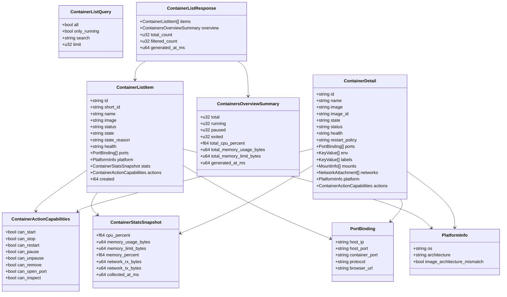

# Phase 2 — Container Management

> **Branch:** `feat/backend-containers`
> **Depends on:** Phase 1 merged to `main`
> **Unlocks:** Phase 6 (streaming needs stable container IDs + typed snapshot contracts)
> **Estimated effort:** 4–6 days

---

## Objective

Implement a desktop-grade container management backend for DockerLens.

Phase 2 is no longer just "make the buttons work." It must expose a stable Rust contract for:

- fast container list loading
- summary data for the top-of-screen container overview
- typed container detail data for the main detail panel
- lifecycle actions with clear capability and error semantics
- one-shot stats snapshots that prepare the way for Phase 6 streaming
- raw inspect data for advanced/debug surfaces

By the end of this phase, the frontend should be able to build a polished container experience without parsing raw Docker responses directly.

---

## What Success Looks Like

The Phase 2 backend should support a container workspace comparable in depth to a mature desktop Docker client:

- searchable, filterable container list rows with stable typed fields
- aggregate counts and resource summary snapshots for the overview area
- typed detail payloads for ports, env vars, mounts, labels, network, health, and restart policy
- row-level action capability metadata so the UI knows which actions are valid
- clear per-command error behavior for invalid input, not found, daemon unavailable, and invalid state transitions
- snapshot stats contracts that can later be streamed without redesigning DTOs

---

## File Map

```mermaid
graph TD
    CLIENT["client.rs\nP1 — Docker client singleton"]

    subgraph CONTAINERS["containers.rs — Phase 2 backend surface"]
        LIST["list_containers(query)\nfast list + summary response"]
        OVERVIEW["get_containers_overview()\naggregate counts + resource summary"]
        DETAIL["get_container_detail(id)\ntyped detail payload"]
        START["start_container(id)"]
        STOP["stop_container(id, timeout?)"]
        RESTART["restart_container(id, timeout?)"]
        PAUSE["pause_container(id)"]
        UNPAUSE["unpause_container(id)"]
        REMOVE["remove_container(id, force, remove_volumes)"]
        INSPECT["inspect_container(id)\nraw inspect JSON for debug/inspect tab"]
        STATS["get_container_stats(id)\none-shot snapshot"]
        BULK["apply_container_action(ids, action)\nper-item result contract"]
    end

    subgraph TYPES["Typed DTOs"]
        Q["ContainerListQuery"]
        LR["ContainerListResponse"]
        LI["ContainerListItem"]
        OV["ContainersOverviewSummary"]
        DT["ContainerDetail"]
        AC["ContainerActionCapabilities"]
        SS["ContainerStatsSnapshot"]
        BR["BulkContainerActionResult"]
    end

    subgraph TESTS["Tests"]
        UNIT["tests/unit/containers.rs"]
        INTEGRATION["tests/integration/commands.rs"]
    end

    CLIENT --> LIST & OVERVIEW & DETAIL & START & STOP & RESTART & PAUSE & UNPAUSE & REMOVE & INSPECT & STATS & BULK
    Q --> LIST
    LIST --> LR
    LR --> LI & OV
    DETAIL --> DT
    DT --> AC & SS
    STATS --> SS
    BULK --> BR
    LI --> AC & SS
    UNIT --> CONTAINERS
    INTEGRATION --> CONTAINERS
```


---

## Backend Contract

### Core principle

The frontend should consume DockerLens DTOs, not raw bollard types and not raw Docker JSON, except on the dedicated Inspect/debug surface.

### Typed model map


---

## Required Commands

| Command | Purpose | Notes |
|---|---|---|
| `list_containers(query)` | Return the main container table data | Must support search and `only_running` filtering |
| `get_containers_overview()` | Return counts + top summary resource snapshot | Used by summary cards / overview area |
| `get_container_detail(id)` | Return typed detail data for selected container | Main detail path, not raw inspect |
| `start_container(id)` | Start a container | Idempotent error semantics |
| `stop_container(id, timeout_secs?)` | Stop a container | Default timeout 10s |
| `restart_container(id, timeout_secs?)` | Restart a container | Default timeout 10s |
| `pause_container(id)` | Pause a running container | Must reject invalid state clearly |
| `unpause_container(id)` | Unpause a paused container | Required for action parity |
| `remove_container(id, force, remove_volumes)` | Remove a container | Replaces `delete_container` naming |
| `inspect_container(id)` | Return raw inspect JSON | Reserved for debug / inspect surfaces |
| `get_container_stats(id)` | Return one-shot typed stats snapshot | Snapshot only in Phase 2 |
| `apply_container_action(ids, action)` | Bulk start/stop/remove/pause/unpause | Per-item result contract; UI may ship later |

---

## DRY Principles for This Phase

- All commands share the same Docker client via Tauri managed state.
- Input validation is centralized and reused across every command that accepts a container ID.
- Mapping from bollard/Docker responses into DockerLens DTOs must be centralized.
- Capability calculation (`can_start`, `can_stop`, etc.) must be a shared helper, never recomputed differently across list/detail paths.
- Stats snapshot mapping must be shared between Phase 2 snapshot commands and future Phase 6 streaming events.

```rust
/// Shared input validation for all container ID parameters.
/// Returns Err(String) which Tauri serialises as a JS rejection.
fn validate_container_id(id: &str) -> Result<(), String> {
    if id.is_empty() {
        return Err("Container ID cannot be empty".to_string());
    }
    if id.len() > 128 {
        return Err("Container ID exceeds maximum length".to_string());
    }
    if !id.chars().all(|c| c.is_alphanumeric() || c == '-' || c == '_') {
        return Err("Container ID contains invalid characters".to_string());
    }
    Ok(())
}
```

---

## Implementation Rules for `containers.rs`

### 1. Snapshot-first design

Phase 2 returns snapshots. Phase 6 will add live streams. Do not design Phase 2 DTOs in a way that forces a breaking redesign later.

### 2. Fail-soft enrichment

`list_containers(query)` must never fail the whole list just because one enrichment step fails.

- Base rows come from `/containers/json`
- Detail enrichment may use inspect data
- Stats enrichment may use one-shot stats
- If enrichment fails for one container, return the row with partial data and mark the field unavailable

### 3. Bounded concurrency

If inspect/stats enrichment is needed for many containers, use bounded concurrency. Never fan out unbounded async work across every container.

### 4. Stable error categories

Commands must return clear `Err(String)` values suitable for user-facing classification:

- invalid input
- container not found
- docker daemon unavailable
- permission denied
- invalid lifecycle transition
- transient Docker API failure

### 5. Idempotent semantics where sensible

- starting an already-running container should return a clear, non-panicking error
- stopping an already-stopped container should return a clear, non-panicking error
- remove/bulk action paths must return per-container outcomes

### 6. Raw inspect is not the main UX contract

`inspect_container(id)` is for the Inspect/debug surface only. The main detail UX must rely on `get_container_detail(id)`.

---

## Rust API Sketch

```rust
pub struct ContainerListQuery {
    pub all: bool,
    pub only_running: bool,
    pub search: Option<String>,
    pub limit: Option<u32>,
}

pub struct ContainerListResponse {
    pub items: Vec<ContainerListItem>,
    pub overview: ContainersOverviewSummary,
    pub total_count: u32,
    pub filtered_count: u32,
    pub generated_at_ms: u64,
}

#[tauri::command]
pub async fn list_containers(
    query: ContainerListQuery,
    client: State<'_, DockerClient>,
) -> Result<ContainerListResponse, String>;

#[tauri::command]
pub async fn get_containers_overview(
    client: State<'_, DockerClient>,
) -> Result<ContainersOverviewSummary, String>;

#[tauri::command]
pub async fn get_container_detail(
    id: String,
    client: State<'_, DockerClient>,
) -> Result<ContainerDetail, String>;

#[tauri::command]
pub async fn apply_container_action(
    ids: Vec<String>,
    action: ContainerBulkAction,
    client: State<'_, DockerClient>,
) -> Result<Vec<BulkContainerActionResult>, String>;
```

---

## Register in `commands.rs`

```rust
pub use crate::docker::containers::{
    list_containers,
    get_containers_overview,
    get_container_detail,
    start_container,
    stop_container,
    restart_container,
    pause_container,
    unpause_container,
    remove_container,
    inspect_container,
    get_container_stats,
    apply_container_action,
};
```

```rust
.invoke_handler(tauri::generate_handler![
    crate::commands::list_containers,
    crate::commands::get_containers_overview,
    crate::commands::get_container_detail,
    crate::commands::start_container,
    crate::commands::stop_container,
    crate::commands::restart_container,
    crate::commands::pause_container,
    crate::commands::unpause_container,
    crate::commands::remove_container,
    crate::commands::inspect_container,
    crate::commands::get_container_stats,
    crate::commands::apply_container_action,
])
```

---

## Testing Requirements

### Unit tests

- ID validation
- capability calculation from lifecycle state
- DTO mapping for list rows, detail payloads, platform flags, and stats snapshots
- browser URL derivation from port bindings
- partial-data / unavailable-data mapping

### Integration tests

- list works when Docker is available
- list still returns rows when stats enrichment is unavailable
- detail returns typed payload for a real container
- inspect returns raw JSON for a real container
- invalid IDs are rejected for every action path
- bulk action returns per-item success/failure results
- daemon unavailable paths return `Err`, never panic

### Performance checks

- list remains responsive with many containers
- stats/inspect fan-out is bounded
- no command blocks the async runtime with sync I/O

---

## Acceptance Criteria

```text
✅ list_containers(query) returns typed rows with stable IDs, image, state, ports, platform metadata, and action capabilities
✅ get_containers_overview() returns total/running/paused/exited counts plus summary CPU/memory snapshot data
✅ get_container_detail(id) returns typed detail data for ports, env vars, labels, mounts, networks, health, restart policy, and platform metadata
✅ start, stop, restart, pause, unpause, remove, inspect, and one-shot stats commands are registered and callable from invoke()
✅ apply_container_action(ids, action) returns per-item outcomes for bulk operations
✅ invalid input, path traversal, daemon unavailable, and invalid lifecycle transitions return Err and never panic
✅ inspect_container returns valid JSON
✅ list enrichment is fail-soft and uses bounded concurrency
✅ typed snapshot DTOs are reusable by Phase 6 streaming without a breaking redesign
✅ cargo clippy --all-targets --all-features -- -D warnings passes
✅ cargo test passes
```
