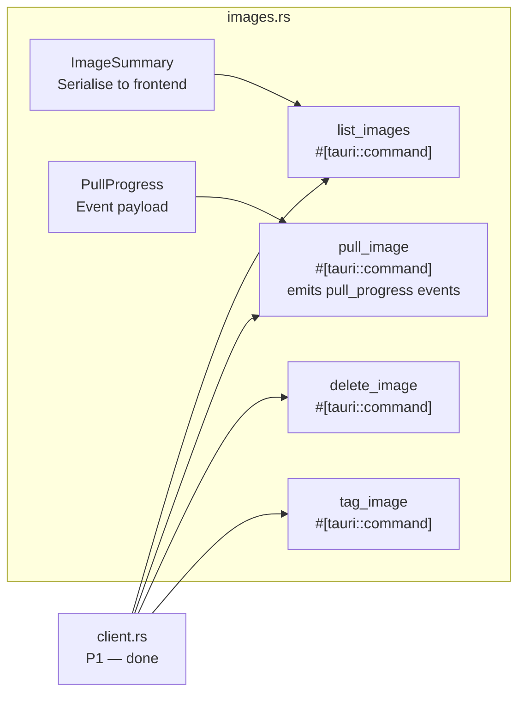

# Phase 3 — Image Management

> **Branch:** `feat/backend-images`
> **Depends on:** Phase 1 merged to `main`
> **Can run in parallel with:** Phase 4 and Phase 5
> **Estimated effort:** 2 days

---

## Objective

Implement list, pull (with layer-by-layer streaming progress), delete and tag for Docker images. The pull command emits real-time Tauri events so the React UI can show layer progress — this is the first use of `emit()` in the backend.

---

## File Map


---

## Key Design — Pull Streaming

Image pulls are the first place we use `app.emit()` to stream progress to React. The pattern established here is reused in Phase 6 for log streaming and stats.
```rust
use bollard::image::CreateImageOptions;
use futures::StreamExt;
use tauri::Emitter;

/// Pull event payload — emitted to React after each layer update.
#[derive(Debug, Serialize, Clone)]
pub struct PullProgress {
    pub status: String,
    pub progress_detail: Option<ProgressDetail>,
    pub id: Option<String>,         // layer ID
    pub progress: Option<String>,   // human-readable e.g. "[==>    ]"
}

#[derive(Debug, Serialize, Clone)]
pub struct ProgressDetail {
    pub current: Option<i64>,
    pub total: Option<i64>,
}

/// Pulls an image from Docker Hub or any registry.
/// Emits "pull_progress" Tauri events for each layer update.
/// Completes when the pull is done or errors.
#[tauri::command]
pub async fn pull_image(
    name: String,
    tag: String,
    app: tauri::AppHandle,
    client: State<'_, DockerClient>,
) -> Result<(), String> {
    validate_image_name(&name)?;
    validate_image_tag(&tag)?;

    let opts = CreateImageOptions {
        from_image: name.as_str(),
        tag: tag.as_str(),
        ..Default::default()
    };

    let mut stream = client.inner.create_image(Some(opts), None, None);

    while let Some(result) = stream.next().await {
        match result {
            Ok(info) => {
                let event = PullProgress {
                    status: info.status.unwrap_or_default(),
                    id: info.id,
                    progress: info.progress,
                    progress_detail: info.progress_detail.map(|d| ProgressDetail {
                        current: d.current,
                        total: d.total,
                    }),
                };
                // Emit to React — non-fatal if the window is closed
                app.emit("pull_progress", &event).ok();
            }
            Err(e) => return Err(format!("Pull failed: {e}")),
        }
    }

    log::info!("Pull complete: {}:{}", name, tag);
    Ok(())
}
```

---

## Input Validation (DRY)
```rust
/// Validates Docker image name — registry/name format.
fn validate_image_name(name: &str) -> Result<(), String> {
    if name.is_empty() || name.len() > 256 {
        return Err("Invalid image name length".to_string());
    }
    // Only allow safe characters — prevent injection
    if !name.chars().all(|c| c.is_alphanumeric() || "/:._-".contains(c)) {
        return Err("Image name contains invalid characters".to_string());
    }
    Ok(())
}

/// Validates Docker image tag.
fn validate_image_tag(tag: &str) -> Result<(), String> {
    if tag.is_empty() || tag.len() > 128 {
        return Err("Invalid tag length".to_string());
    }
    if !tag.chars().all(|c| c.is_alphanumeric() || "._-".contains(c)) {
        return Err("Tag contains invalid characters".to_string());
    }
    Ok(())
}
```

---

## Acceptance Criteria
```
✅ list_images returns real images with correct sizes
✅ pull_image emits pull_progress events — React receives each layer
✅ delete_image removes the image — confirmed absent from list_images
✅ Image name + tag validation rejects malicious inputs
✅ Pull of non-existent image → clean Err, not a panic
✅ cargo clippy -- -D warnings → zero warnings
```