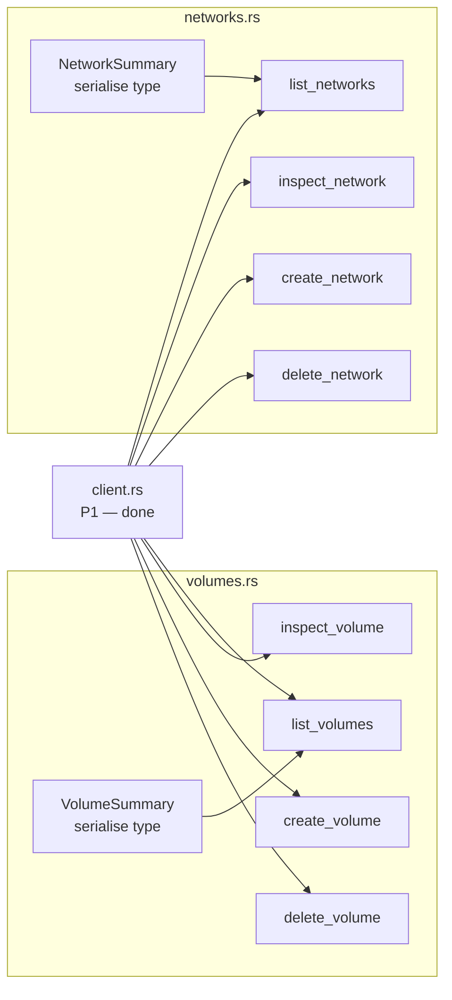

# Phase 4 — Volumes & Networks

> **Branch:** `feat/backend-volumes-networks`
> **Depends on:** Phase 1 merged to `main`
> **Can run in parallel with:** Phase 3 and Phase 5
> **Estimated effort:** 1–2 days

---

## Objective

Implement full CRUD for volumes and networks. Both are structurally similar — they share the same command pattern, DRY input validation approach and error handling style.

---

## File Map


---

## DRY Pattern — Shared Validation Helper

Both modules use the same naming validation. Extract to a shared utility rather than duplicating:
```rust
// src-tauri/src/docker/mod.rs — add shared helpers
/// Validates a Docker resource name (volume or network).
/// DRY — used by volumes.rs and networks.rs.
pub fn validate_resource_name(name: &str, resource: &str) -> Result<(), String> {
    if name.is_empty() {
        return Err(format!("{resource} name cannot be empty"));
    }
    if name.len() > 255 {
        return Err(format!("{resource} name exceeds maximum length"));
    }
    if !name.chars().all(|c| c.is_alphanumeric() || c == '-' || c == '_' || c == '.') {
        return Err(format!("{resource} name contains invalid characters"));
    }
    Ok(())
}
```

Usage in volumes.rs:
```rust
crate::docker::validate_resource_name(&name, "Volume")?;
```

Usage in networks.rs:
```rust
crate::docker::validate_resource_name(&name, "Network")?;
```

---

## Key Types
```rust
// volumes.rs
#[derive(Debug, Serialize, Deserialize)]
pub struct VolumeSummary {
    pub name: String,
    pub driver: String,
    pub mountpoint: String,
    pub created_at: Option<String>,
    pub labels: HashMap<String, String>,
    pub scope: String,
}

// networks.rs
#[derive(Debug, Serialize, Deserialize)]
pub struct NetworkSummary {
    pub id: String,
    pub name: String,
    pub driver: String,
    pub scope: String,
    pub internal: bool,
    pub ipam_config: Vec<IpamConfig>,
    pub containers: HashMap<String, NetworkContainer>,
    pub labels: HashMap<String, String>,
}

#[derive(Debug, Serialize, Deserialize)]
pub struct IpamConfig {
    pub subnet: Option<String>,
    pub gateway: Option<String>,
}

#[derive(Debug, Serialize, Deserialize)]
pub struct NetworkContainer {
    pub name: String,
    pub endpoint_id: String,
    pub mac_address: String,
    pub ipv4_address: String,
}
```

---

## Safety Rules

- `delete_volume` must check the volume is not in use before deletion
- Built-in networks (`bridge`, `host`, `none`) must never be deletable — guard in Rust, not just the UI
- `delete_network` returns a specific error if containers are still attached
```rust
#[tauri::command]
pub async fn delete_network(
    id: String,
    client: State<'_, DockerClient>,
) -> Result<(), String> {
    crate::docker::validate_resource_name(&id, "Network")?;

    // Guard — never allow deletion of built-in networks
    let built_in = ["bridge", "host", "none"];
    if built_in.contains(&id.as_str()) {
        return Err(format!("Cannot delete built-in network: {id}"));
    }

    client.inner
        .remove_network(&id)
        .await
        .map_err(|e| format!("Failed to delete network {id}: {e}"))
}
```

---

## Acceptance Criteria
```
✅ list_volumes and list_networks return correct data
✅ create_volume → appears in list_volumes
✅ delete_volume with attached containers → returns clear error
✅ delete_network("bridge") → returns error (built-in guard)
✅ Shared validate_resource_name used in both modules — no duplication
✅ cargo clippy -- -D warnings → zero warnings
```