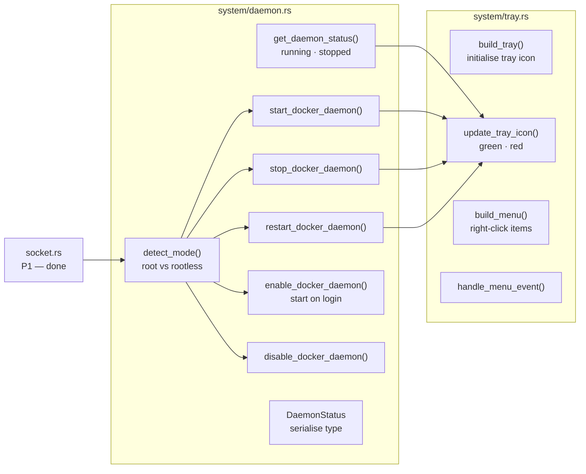

# Phase 5 — Daemon Control & System Tray

> **Branch:** `feat/backend-daemon-tray`
> **Depends on:** Phase 1 merged to `main`
> **Can run in parallel with:** Phase 3 and Phase 4
> **Unlocks:** Phase 7 (config + notifications need daemon state)
> **Estimated effort:** 2–3 days

---

## Objective

Implement Docker daemon lifecycle control (start, stop, restart, enable on login) with native privilege escalation via Polkit. Implement the system tray with live daemon state and a right-click menu.

This phase makes DockerLens feel like Docker Desktop on Windows/Mac — daemon control from the UI with no terminal.

---

## File Map


---

## Root vs Rootless Detection (DRY)
```rust
/// Docker operation mode — determines how daemon commands are run.
/// DRY: detected once, used by all daemon commands.
#[derive(Debug, Clone, PartialEq)]
pub enum DockerMode {
    /// Standard Docker — requires Polkit elevation
    Root,
    /// Rootless Docker — current user runs the daemon, no elevation needed
    Rootless,
}

/// Detects whether the user is running root or rootless Docker.
/// Single source of truth — all daemon commands call this.
pub fn detect_mode() -> DockerMode {
    let home = std::env::var("HOME").unwrap_or_default();
    let rootless_socket = format!("{}/.docker/run/docker.sock", home);

    if std::path::Path::new(&rootless_socket).exists() {
        DockerMode::Rootless
    } else {
        DockerMode::Root
    }
}
```

---

## Daemon Command Pattern

All 5 daemon commands share the same structure — detect mode, choose command, execute, emit state event. Extract the execution to avoid duplication:
```rust
/// Executes a systemctl command — root or rootless variant.
/// DRY: used by start, stop, restart, enable, disable.
fn run_systemctl(args: &[&str], mode: &DockerMode) -> Result<(), String> {
    let mut cmd = if *mode == DockerMode::Rootless {
        let mut c = std::process::Command::new("systemctl");
        c.arg("--user");
        c.args(args);
        c
    } else {
        // Root: use pkexec for native Polkit dialog — no terminal
        let mut c = std::process::Command::new("pkexec");
        c.arg("systemctl");
        c.args(args);
        c
    };

    let status = cmd.status()
        .map_err(|e| format!("Failed to run systemctl: {e}"))?;

    if status.success() {
        Ok(())
    } else {
        Err(format!("systemctl {:?} returned non-zero status", args))
    }
}

#[tauri::command]
pub async fn start_docker_daemon(
    app: tauri::AppHandle,
) -> Result<DaemonStatus, String> {
    let mode = detect_mode();
    run_systemctl(&["start", "docker"], &mode)?;

    // Emit state change — tray + sidebar pill both listen
    let status = DaemonStatus { running: true, socket_path: crate::system::socket::display_path() };
    app.emit("daemon_state", &status).ok();
    Ok(status)
}
```

---

## System Tray
```rust
// system/tray.rs
use tauri::{
    tray::{TrayIconBuilder, TrayIconEvent, MouseButton, MouseButtonState},
    menu::{Menu, MenuItem},
    Manager,
};

pub fn build_tray(app: &tauri::App) -> tauri::Result<()> {
    let quit = MenuItem::with_id(app, "quit", "Quit DockerLens", true, None::<&str>)?;
    let open = MenuItem::with_id(app, "open", "Open DockerLens", true, None::<&str>)?;
    let menu = Menu::with_items(app, &[&open, &quit])?;

    TrayIconBuilder::new()
        .icon(app.default_window_icon().unwrap().clone())
        .menu(&menu)
        .on_menu_event(handle_menu_event)
        .on_tray_icon_event(|tray, event| {
            if let TrayIconEvent::Click {
                button: MouseButton::Left,
                button_state: MouseButtonState::Up,
                ..
            } = event {
                if let Some(window) = tray.app_handle().get_webview_window("main") {
                    window.show().ok();
                    window.set_focus().ok();
                }
            }
        })
        .build(app)?;

    Ok(())
}

fn handle_menu_event(app: &tauri::AppHandle, event: tauri::menu::MenuEvent) {
    match event.id.as_ref() {
        "quit" => app.exit(0),
        "open" => {
            if let Some(window) = app.get_webview_window("main") {
                window.show().ok();
                window.set_focus().ok();
            }
        }
        _ => {}
    }
}
```

---

## Acceptance Criteria
```
✅ detect_mode() returns Root on standard Docker, Rootless on rootless
✅ start_docker_daemon() → Polkit dialog appears (root) or succeeds silently (rootless)
✅ start_docker_daemon() emits daemon_state event → tray + sidebar update
✅ Tray icon visible in GNOME (requires AppIndicator extension — document if missing)
✅ Tray right-click → Open and Quit work
✅ run_systemctl used by all 5 daemon commands — no duplication
✅ cargo clippy -- -D warnings → zero warnings
```