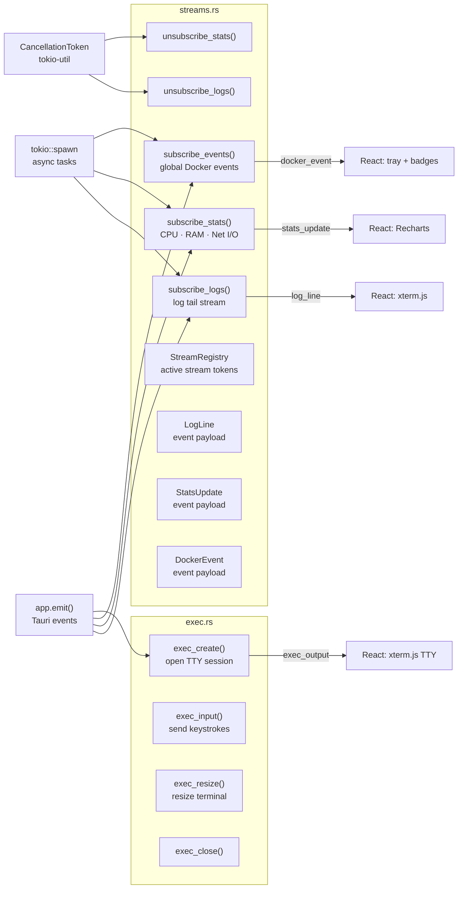

# Phase 6 — Real-Time Streaming

> **Branch:** `feat/backend-streaming`
> **Depends on:** Phase 2 merged to `main` (needs container IDs)
> **Unlocks:** Frontend Logs tab, Stats tab, Terminal tab
> **Estimated effort:** 3–4 days (most complex phase)

---

## Objective

Implement three real-time streams — live logs, live stats and the global Docker event stream — plus the WebSocket exec session for the terminal tab. All streams use Tokio async tasks and emit Tauri events to React with sub-50ms latency.

---

## File Map


---

## Stream Lifecycle Management (DRY + Safe)

The hardest part of streaming is managing multiple concurrent streams — one per container for logs and stats — and cancelling them cleanly when the user navigates away.
```rust
use std::collections::HashMap;
use std::sync::Mutex;
use tokio_util::sync::CancellationToken;

/// Registry of all active stream cancellation tokens.
/// Stored as Tauri managed state alongside DockerClient.
/// DRY: all streams register here — one place to cancel all.
pub struct StreamRegistry {
    inner: Mutex<HashMap<String, CancellationToken>>,
}

impl StreamRegistry {
    pub fn new() -> Self {
        Self { inner: Mutex::new(HashMap::new()) }
    }

    /// Register a new stream with a unique key.
    /// Returns the token to pass to the stream task.
    pub fn register(&self, key: &str) -> CancellationToken {
        let token = CancellationToken::new();
        self.inner.lock().unwrap().insert(key.to_string(), token.clone());
        token
    }

    /// Cancel a specific stream by key.
    pub fn cancel(&self, key: &str) {
        if let Some(token) = self.inner.lock().unwrap().remove(key) {
            token.cancel();
            log::debug!("Stream cancelled: {}", key);
        }
    }

    /// Cancel all active streams (called on app shutdown).
    pub fn cancel_all(&self) {
        let mut map = self.inner.lock().unwrap();
        for (key, token) in map.drain() {
            token.cancel();
            log::debug!("Stream cancelled on shutdown: {}", key);
        }
    }
}
```

---

## Log Streaming
```rust
/// Event payload emitted to React for each log line.
#[derive(Debug, Serialize, Clone)]
pub struct LogLine {
    pub container_id: String,
    pub line: String,
    pub timestamp: Option<String>,
    pub stream: String,   // "stdout" or "stderr"
}

/// Starts a live log stream for a container.
/// Emits "log_line" Tauri events to React.
/// Stores a cancellation token in StreamRegistry so it can be stopped.
#[tauri::command]
pub async fn subscribe_logs(
    container_id: String,
    app: tauri::AppHandle,
    client: State<'_, DockerClient>,
    registry: State<'_, StreamRegistry>,
) -> Result<(), String> {
    use bollard::container::LogsOptions;
    use futures::StreamExt;

    let token = registry.register(&format!("logs:{}", container_id));
    let id_clone = container_id.clone();

    let mut stream = client.inner.logs(
        &container_id,
        Some(LogsOptions::<String> {
            follow: true,
            stdout: true,
            stderr: true,
            timestamps: true,
            tail: "100".to_string(),   // last 100 lines on connect
            ..Default::default()
        }),
    );

    tokio::spawn(async move {
        loop {
            tokio::select! {
                _ = token.cancelled() => {
                    log::debug!("Log stream cancelled for {}", id_clone);
                    break;
                }
                item = stream.next() => {
                    match item {
                        Some(Ok(output)) => {
                            use bollard::container::LogOutput;
                            let (line, stream_type) = match output {
                                LogOutput::StdOut { message } =>
                                    (String::from_utf8_lossy(&message).to_string(), "stdout"),
                                LogOutput::StdErr { message } =>
                                    (String::from_utf8_lossy(&message).to_string(), "stderr"),
                                _ => continue,
                            };

                            let event = LogLine {
                                container_id: id_clone.clone(),
                                line,
                                timestamp: None,
                                stream: stream_type.to_string(),
                            };
                            app.emit("log_line", &event).ok();
                        }
                        Some(Err(e)) => {
                            log::warn!("Log stream error for {}: {}", id_clone, e);
                            break;
                        }
                        None => break,  // stream ended
                    }
                }
            }
        }
    });

    Ok(())
}

/// Stops the log stream for a container.
#[tauri::command]
pub async fn unsubscribe_logs(
    container_id: String,
    registry: State<'_, StreamRegistry>,
) -> Result<(), String> {
    registry.cancel(&format!("logs:{}", container_id));
    Ok(())
}
```

---

## Register `StreamRegistry` in `lib.rs`
```rust
// lib.rs — add alongside DockerClient
.setup(|app| {
    // Docker client
    match crate::docker::DockerClient::connect() {
        Ok(client) => { app.manage(client); }
        Err(e) => { log::warn!("Docker not available: {}", e); }
    }

    // Stream registry — always available
    app.manage(crate::docker::streams::StreamRegistry::new());

    Ok(())
})
```

---

## Exec (Terminal Tab)
```rust
/// Opens an exec session for the terminal tab.
/// Returns an exec ID that the frontend uses for subsequent input/resize calls.
#[tauri::command]
pub async fn exec_create(
    container_id: String,
    app: tauri::AppHandle,
    client: State<'_, DockerClient>,
    registry: State<'_, StreamRegistry>,
) -> Result<String, String> {
    use bollard::exec::{CreateExecOptions, StartExecOptions};

    let exec = client.inner
        .create_exec(&container_id, CreateExecOptions::<&str> {
            attach_stdin: Some(true),
            attach_stdout: Some(true),
            attach_stderr: Some(true),
            tty: Some(true),
            cmd: Some(vec!["/bin/sh"]),
            ..Default::default()
        })
        .await
        .map_err(|e| format!("Failed to create exec: {e}"))?;

    let exec_id = exec.id.clone();
    // Stream output in a background task, emit exec_output events
    // Full implementation: attach stdin via a separate channel
    log::info!("Exec session created: {}", exec_id);
    Ok(exec_id)
}
```

---

## Acceptance Criteria
```
✅ subscribe_logs → React xterm.js receives lines within 50ms
✅ unsubscribe_logs → stream stops, no memory leak
✅ subscribe_stats → Recharts updates every ~1 second
✅ subscribe_events → daemon crash detected and emitted
✅ cancel_all() called on app close — no zombie tasks
✅ StreamRegistry has no duplicate keys — idempotent subscribe
✅ cargo clippy -- -D warnings → zero warnings
```