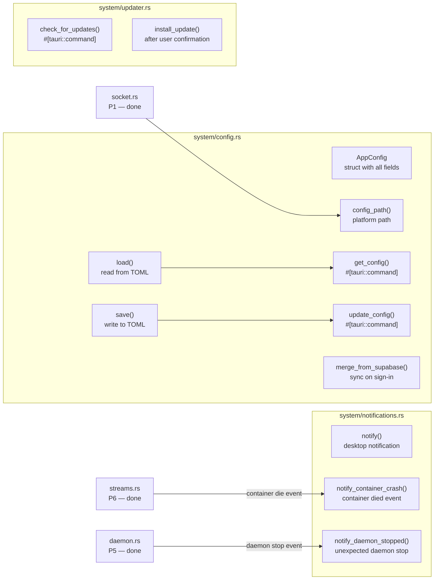
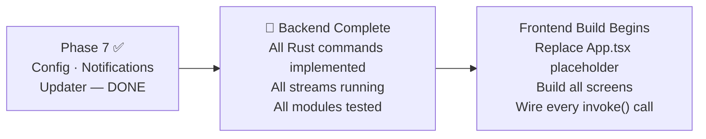

# Phase 7 — Config, Notifications & Updater

> **Branch:** `feat/backend-config-notifications`
> **Depends on:** Phase 5 merged to `main`
> **This is the final backend phase**
> **Estimated effort:** 1–2 days

---

## Objective

Implement persistent TOML configuration (the offline-first store for user preferences), desktop notifications for container crashes and daemon events, and the GitHub Releases auto-updater. After this phase the entire Rust backend is complete.

---

## File Map


---

## AppConfig — Single Source of Truth for All Settings
```rust
use serde::{Deserialize, Serialize};
use std::path::PathBuf;

/// All user-configurable preferences stored locally.
/// Mirrors the Supabase user_preferences schema — kept in sync by merge_from_supabase().
/// DRY: one struct used for both TOML storage and Tauri command return types.
#[derive(Debug, Serialize, Deserialize, Clone)]
pub struct AppConfig {
    /// UI theme — "dark" | "light" | "system"
    #[serde(default = "default_theme")]
    pub theme: String,

    /// Docker socket path override — empty string = auto-detect
    #[serde(default)]
    pub socket_path: String,

    /// Desktop notifications on/off
    #[serde(default = "default_true")]
    pub notifications_enabled: bool,

    /// Start Docker on OS login
    #[serde(default = "default_true")]
    pub start_on_login: bool,

    /// Suggestion IDs the user has permanently dismissed
    #[serde(default)]
    pub dismissed_suggestions: Vec<String>,
}

impl Default for AppConfig {
    fn default() -> Self {
        Self {
            theme: "dark".to_string(),
            socket_path: String::new(),
            notifications_enabled: true,
            start_on_login: true,
            dismissed_suggestions: Vec::new(),
        }
    }
}

fn default_theme() -> String { "dark".to_string() }
fn default_true() -> bool { true }

/// Returns the path to the config file.
/// DRY: single function — never hardcode this path.
/// ~/.config/dockerlens/config.toml on Linux
pub fn config_path() -> PathBuf {
    dirs::config_dir()
        .unwrap_or_else(|| PathBuf::from("/tmp"))
        .join("dockerlens")
        .join("config.toml")
}

/// Loads config from disk.
/// Returns Default if the file doesn't exist — first launch.
pub fn load() -> AppConfig {
    let path = config_path();

    match std::fs::read_to_string(&path) {
        Ok(contents) => {
            toml::from_str(&contents).unwrap_or_else(|e| {
                log::warn!("Config parse error ({}): {} — using defaults", path.display(), e);
                AppConfig::default()
            })
        }
        Err(_) => {
            log::info!("No config file found — using defaults");
            AppConfig::default()
        }
    }
}

/// Saves config to disk.
/// Creates parent directory if it doesn't exist.
pub fn save(config: &AppConfig) -> Result<(), String> {
    let path = config_path();

    if let Some(parent) = path.parent() {
        std::fs::create_dir_all(parent)
            .map_err(|e| format!("Failed to create config directory: {e}"))?;
    }

    let toml = toml::to_string_pretty(config)
        .map_err(|e| format!("Failed to serialise config: {e}"))?;

    std::fs::write(&path, toml)
        .map_err(|e| format!("Failed to write config: {e}"))?;

    log::debug!("Config saved to {}", path.display());
    Ok(())
}

#[tauri::command]
pub fn get_config() -> AppConfig {
    load()
}

#[tauri::command]
pub fn update_config(config: AppConfig) -> Result<AppConfig, String> {
    // Validate theme value before saving
    if !["dark", "light", "system"].contains(&config.theme.as_str()) {
        return Err(format!("Invalid theme value: {}", config.theme));
    }
    if config.socket_path.len() > 512 {
        return Err("Socket path exceeds maximum length".to_string());
    }

    save(&config)?;
    Ok(config)
}
```

---

## Notifications
```rust
// system/notifications.rs
use tauri_plugin_notification::NotificationExt;

/// Shows a desktop notification.
/// DRY: single entry point for all notifications.
pub fn notify(app: &tauri::AppHandle, title: &str, body: &str) {
    // Check user preference before showing
    let config = crate::system::config::load();
    if !config.notifications_enabled {
        return;
    }

    app.notification()
        .builder()
        .title(title)
        .body(body)
        .show()
        .unwrap_or_else(|e| log::warn!("Failed to show notification: {e}"));
}

/// Called when a container's 'die' event is received from the event stream.
pub fn notify_container_crash(app: &tauri::AppHandle, container_name: &str) {
    notify(
        app,
        "Container crashed",
        &format!("{} stopped unexpectedly", container_name),
    );
}

/// Called when the daemon stops unexpectedly.
pub fn notify_daemon_stopped(app: &tauri::AppHandle) {
    notify(
        app,
        "Docker daemon stopped",
        "The Docker daemon stopped unexpectedly. Click to restart.",
    );
}
```

---

## Auto-Updater
```rust
// system/updater.rs
use tauri_plugin_updater::UpdaterExt;
use serde::Serialize;

#[derive(Serialize)]
pub struct UpdateInfo {
    pub available: bool,
    pub version: Option<String>,
    pub body: Option<String>,
}

/// Checks GitHub Releases for a newer version.
/// Returns update info — never installs automatically.
/// User must explicitly call install_update() after seeing the prompt.
#[tauri::command]
pub async fn check_for_updates(app: tauri::AppHandle) -> Result<UpdateInfo, String> {
    let update = app
        .updater()
        .map_err(|e| format!("Updater not configured: {e}"))?
        .check()
        .await
        .map_err(|e| format!("Update check failed: {e}"))?;

    match update {
        Some(u) => {
            log::info!("Update available: {}", u.version);
            Ok(UpdateInfo {
                available: true,
                version: Some(u.version),
                body: u.body,
            })
        }
        None => {
            log::info!("App is up to date");
            Ok(UpdateInfo { available: false, version: None, body: None })
        }
    }
}
```

---

## Register Everything in `lib.rs`
```rust
// Final lib.rs with all phases registered
.invoke_handler(tauri::generate_handler![
    // Phase 1
    crate::commands::list_containers,
    // Phase 2
    crate::commands::start_container,
    crate::commands::stop_container,
    crate::commands::restart_container,
    crate::commands::pause_container,
    crate::commands::delete_container,
    crate::commands::inspect_container,
    crate::commands::get_container_stats,
    // Phase 3
    crate::commands::list_images,
    crate::commands::pull_image,
    crate::commands::delete_image,
    crate::commands::tag_image,
    // Phase 4
    crate::commands::list_volumes,
    crate::commands::create_volume,
    crate::commands::delete_volume,
    crate::commands::list_networks,
    crate::commands::create_network,
    crate::commands::delete_network,
    // Phase 5
    crate::commands::start_docker_daemon,
    crate::commands::stop_docker_daemon,
    crate::commands::restart_docker_daemon,
    crate::commands::enable_docker_daemon,
    crate::commands::disable_docker_daemon,
    crate::commands::get_daemon_status,
    // Phase 6
    crate::commands::subscribe_logs,
    crate::commands::unsubscribe_logs,
    crate::commands::subscribe_stats,
    crate::commands::unsubscribe_stats,
    crate::commands::subscribe_events,
    crate::commands::exec_create,
    crate::commands::exec_input,
    crate::commands::exec_resize,
    crate::commands::exec_close,
    // Phase 7
    crate::commands::get_config,
    crate::commands::update_config,
    crate::commands::check_for_updates,
])
```

---

## Backend Complete — What's Unlocked


---

## Acceptance Criteria
```
✅ get_config returns AppConfig with correct defaults on first launch
✅ update_config saves to ~/.config/dockerlens/config.toml
✅ update_config rejects invalid theme values
✅ notify_container_crash shows notification (when notifications_enabled = true)
✅ notify() does nothing when notifications_enabled = false
✅ check_for_updates returns UpdateInfo without installing anything
✅ Config file survives app restart — persisted correctly
✅ cargo clippy -- -D warnings → zero warnings
✅ cargo test → all unit tests pass
✅ Full pnpm tauri dev build with all commands → zero compile errors
```
```

---

The folder structure is:
```
docs/plan/
├── README.md                          ← full phase map + dependency diagrams
└── backend/
    ├── PHASE-1-FOUNDATION.md          ← socket + bollard + list_containers
    ├── PHASE-2-CONTAINERS.md          ← full container CRUD
    ├── PHASE-3-IMAGES.md              ← images + pull streaming
    ├── PHASE-4-VOLUMES-NETWORKS.md    ← volumes + networks CRUD
    ├── PHASE-5-DAEMON-SYSTEM.md       ← daemon control + tray
    ├── PHASE-6-STREAMING.md           ← logs + stats + events + exec
    └── PHASE-7-CONFIG-NOTIFICATIONS.md ← config + notifications + updater